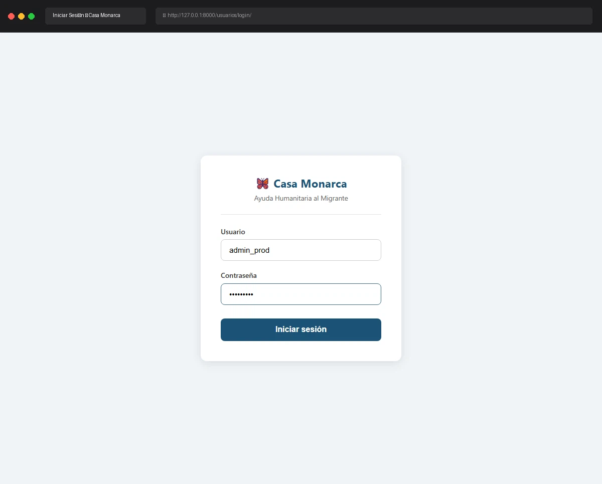

# Caso de Prueba: TC-01-01

**Rol:** Administrador  
**Descripción:** Login exitoso con credenciales válidas de Administrador. Verificar redirect a Dashboard y que la sesión criptográfica se desbloquee automáticamente (llaves RSA y llaves de rol en caché).  
**Metodología:** Login  

## Evidencia de Ejecución

A continuación se muestra el video de la ejecución del caso de prueba usando Chromium:

## Pasos Realizados y Verificaciones

1. **Ingreso a Login:** Navegación exitosa a `http://127.0.0.1:8000/usuarios/login/`.
2. **Autenticación:** Se ingresaron las credenciales del usuario `admin_prod`.
3. **Redirección:** Redirección automática al Dashboard.
4. **Validación Criptográfica:** Al abrir el panel de "Seguridad y Permisos", se validó que:
   - **Llaves RSA:** Activas
   - **Certificado X.509:** Activo
