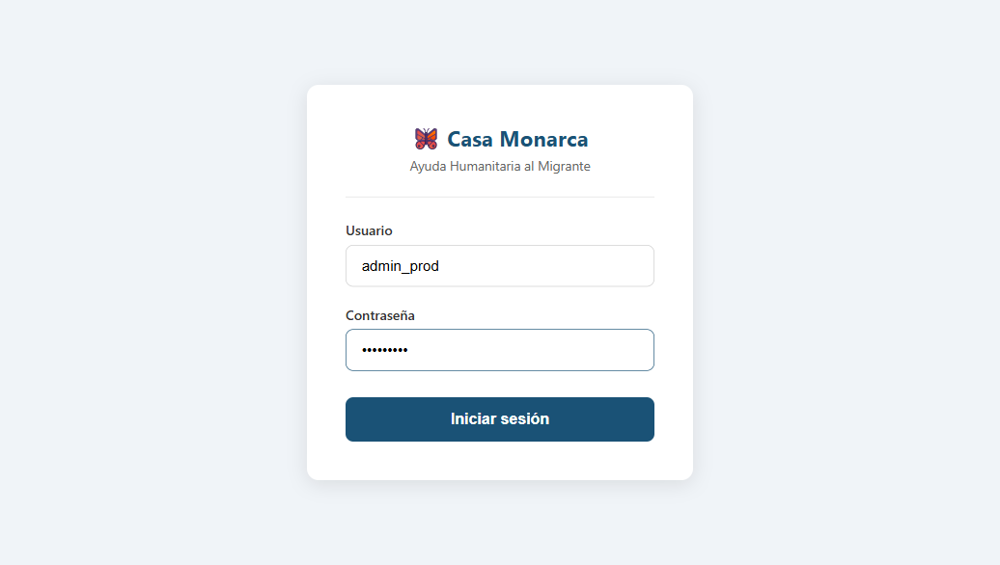
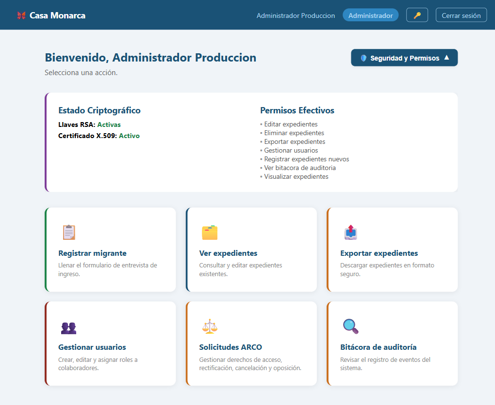

# Caso de Prueba: TC-01-01 — Login exitoso (Administrador)

| Campo | Valor |
|---|---|
| **Rol(es)** | Administrador |
| **Categoría** | 01 — Autenticación |
| **Metodología** | Login |
| **Fecha de ejecución** | 2026-05-28 |
| **Motor** | Playwright MCP (Claude Code) |
| **Estado** | ✅ PASS |

## Descripción
Login exitoso con credenciales válidas de Administrador. Verifica el redirect al Dashboard y que la sesión criptográfica se desbloquee automáticamente (llaves RSA y certificado X.509 activos).

## Precondiciones
- Usuario `admin_prod` / `adminprod` (rol Administrador) existente en la BD.
- Servidor en `http://127.0.0.1:8000`; navegador sin sesión previa.

## Pasos ejecutados
| # | Acción | Ubicación / Selector / Dato | Resultado esperado | Evidencia |
|---|---|---|---|---|
| 1 | Navegar al login | `/usuarios/login/` | Se muestra el formulario de inicio de sesión | `TC-01-01_paso-1.png` |
| 2 | Capturar credenciales | `#id_username` = `admin_prod` · `#id_password` = `adminprod` | Campos completados | `TC-01-01_paso-2.png` |
| 3 | Enviar formulario | `button.btn-login` | Redirect a `/expediente/dashboard/` con el rol "Administrador" en la barra | `TC-01-01_paso-3.png` |
| 4 | Abrir panel de seguridad | `#toggle-status` ("🛡️ Seguridad y Permisos") | Panel muestra estado criptográfico desbloqueado | `TC-01-01_paso-4.png` |

## Resultado esperado
- El login redirige a `/expediente/dashboard/`.
- La barra superior muestra el rol **Administrador**.
- El panel "Estado Criptográfico" indica **Llaves RSA: Activas** y **Certificado X.509: Activo**.
- Se ofrece la tarjeta **Gestionar usuarios** (privilegio exclusivo de Administrador).

## Resultado obtenido
- ✅ URL final: `http://127.0.0.1:8000/expediente/dashboard/`.
- ✅ Barra superior: `Administrador Produccion` con badge de rol **Administrador**.
- ✅ Panel "Estado Criptográfico": **Llaves RSA: Activas** · **Certificado X.509: Activo**.
- ✅ Permisos efectivos listados (Editar/Eliminar/Exportar/Visualizar expedientes, Gestionar usuarios, Ver bitácora, Registrar) y tarjeta **Gestionar usuarios** presente.

## Verificación en BD
No aplica (caso de UI; el registro en bitácora se valida en TC-01-08).

## Evidencia

**Paso 1 — Formulario de login**

**Paso 2 — Credenciales capturadas**

**Paso 3 — Redirect al Dashboard (rol Administrador)**

**Paso 4 — Panel de Estado Criptográfico (RSA activas, certificado activo)**

**Evidencia animada (corrida previa, conservada como resumen):**

## Conclusión
✅ **PASS.** El Administrador inicia sesión correctamente, es redirigido al Dashboard y su sesión criptográfica se desbloquea de forma automática (llaves RSA y certificado X.509 activos), con acceso a las funciones de gestión correspondientes a su rol.
