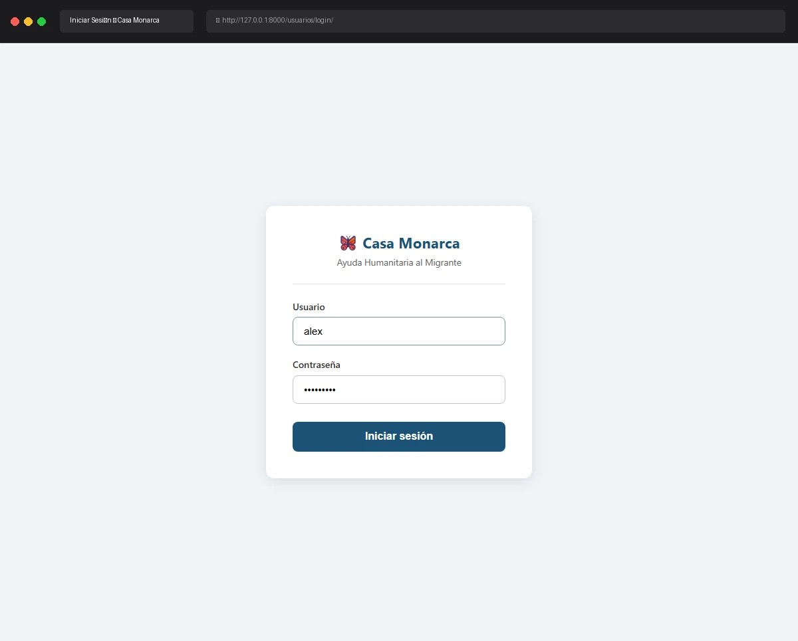

# Caso de Prueba: TC-01-02

**Rol:** Coordinador  
**Descripción:** Login exitoso con credenciales válidas de cualquier Coordinador (Legal, Administración, Psicosocial, Humanitario, Comunicación). Verificar redirect a Dashboard, desbloqueo de llave privada y carga de llaves de rol correspondientes.  
**Metodología:** Login  

## Evidencia de Ejecución

A continuación se muestra el video de la ejecución del caso de prueba usando Chromium:

## Pasos Realizados y Verificaciones

1. **Cierre de sesión previa:** Se cerró la sesión del usuario Administrador.
2. **Ingreso a Login:** Navegación a `http://127.0.0.1:8000/usuarios/login/`.
3. **Autenticación:** Se ingresaron las credenciales del usuario `alex` (Rol: `Coordinador_Humanitario`).
4. **Redirección:** Redirección automática al Dashboard.
5. **Validación Criptográfica:** Al abrir el panel de "Seguridad y Permisos", se validó que:
   - **Llaves RSA:** Activas
   - **Certificado X.509:** Activo
   - **Rol asignado:** `Coordinador_Humanitario`
