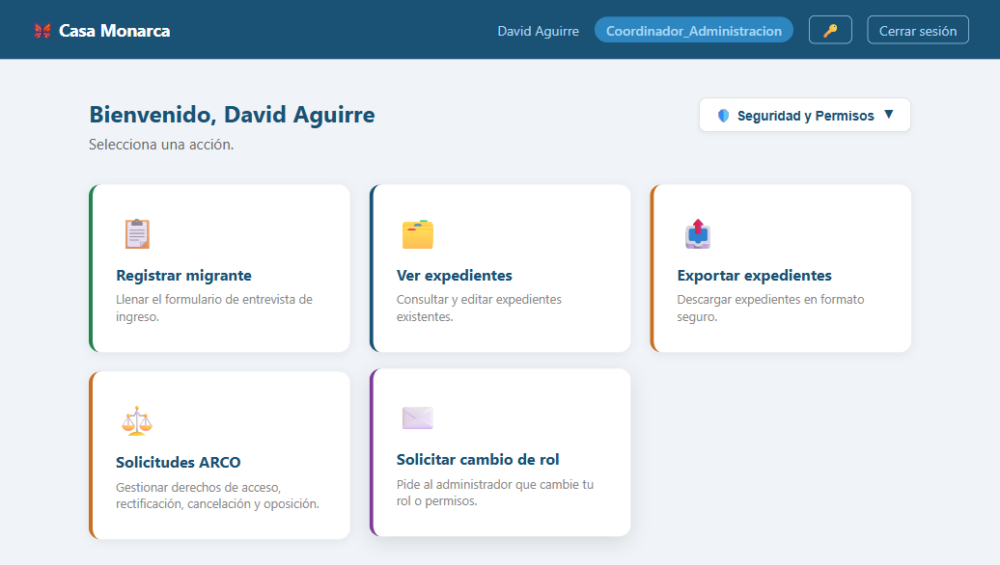
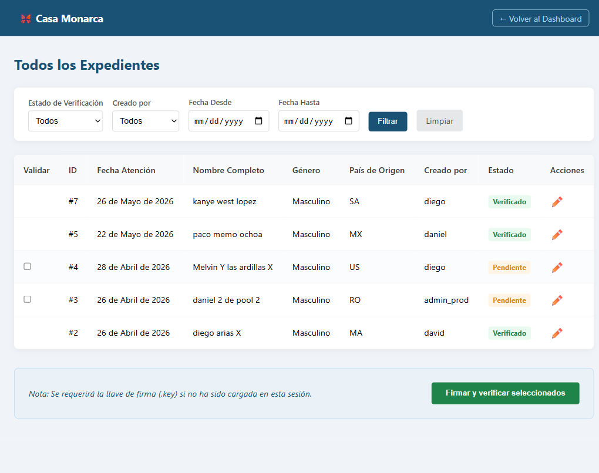

# Caso de Prueba: TC-01-02 — Login exitoso (Coordinador)

| Campo | Valor |
|---|---|
| **Rol(es)** | Coordinador (Administración / Legal / Psicosocial / Humanitario / Comunicación) |
| **Categoría** | 01 — Autenticación |
| **Metodología** | Login |
| **Fecha de ejecución** | 2026-05-28 |
| **Motor** | Playwright MCP (Claude Code) |
| **Estado** | ✅ PASS |

## Descripción
Login exitoso con credenciales válidas de un Coordinador. Verifica el redirect al Dashboard, el desbloqueo de la llave privada y la carga de la **llave de rol**, comprobada al acceder a la lista de expedientes (operación protegida por `@rol_requerido`).

## Precondiciones
- Usuario `david` / `admindavid` (rol `Coordinador_Administracion`).
- Servidor en `http://127.0.0.1:8000`; sin sesión previa.

## Pasos ejecutados
| # | Acción | Ubicación / Selector / Dato | Resultado esperado | Evidencia |
|---|---|---|---|---|
| 1 | Login como Coordinador | `/usuarios/login/` · `david` / `admindavid` | Redirect al Dashboard con rol `Coordinador_Administracion` | `TC-01-02_paso-1.png` |
| 2 | Acceder a "Ver expedientes" | `/expediente/expedientes/` | La lista carga (sin logout forzado) → llave de rol desbloqueada | `TC-01-02_paso-2.png` |

## Resultado esperado
- Redirect a `/expediente/dashboard/`; barra con rol `Coordinador_Administracion`.
- Panel cripto: **Llaves RSA: Activas**, **Certificado X.509: Activo**.
- La lista de expedientes se descifra y muestra (si la llave de rol no estuviera en `_llaves_rol_cache`, `@rol_requerido` forzaría logout).

## Resultado obtenido
- ✅ Redirect a Dashboard; barra: `David Aguirre` · badge `Coordinador_Administracion`.
- ✅ Panel (snapshot): **Llaves RSA: Activas** · **Certificado X.509: Activo**.
- ✅ `/expediente/expedientes/` cargó correctamente (título "Expedientes — Casa Monarca"), confirmando el desbloqueo de la llave de rol.

## Verificación en BD
No aplica (se valida funcionalmente vía el acceso a expedientes).

## Evidencia

**Paso 1 — Dashboard del Coordinador (rol + estado criptográfico)**

**Paso 2 — Lista de expedientes descifrada (prueba del desbloqueo de llave de rol)**

**Evidencia animada (corrida previa, conservada como resumen):**

## Conclusión
✅ **PASS.** El Coordinador inicia sesión, su sesión criptográfica se desbloquea (llave privada + llave de rol) y puede descifrar la lista de expedientes correspondiente a su rol.
