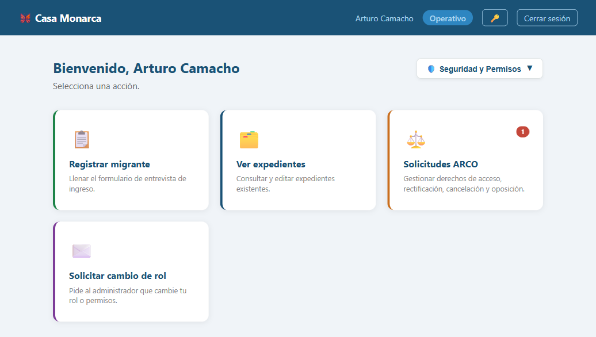
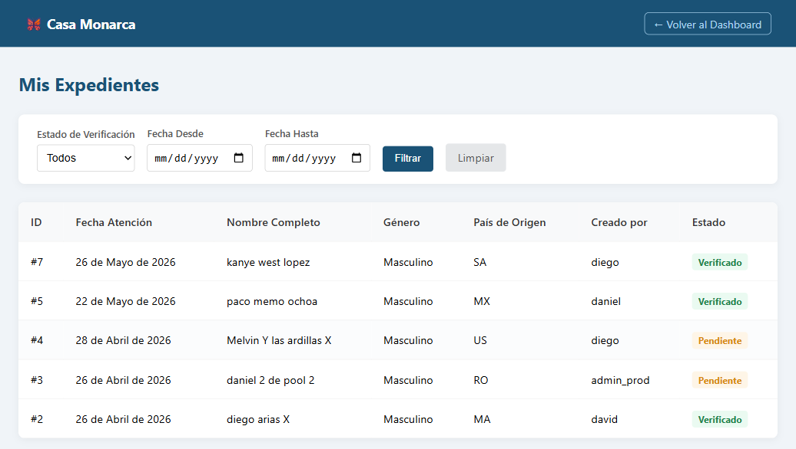
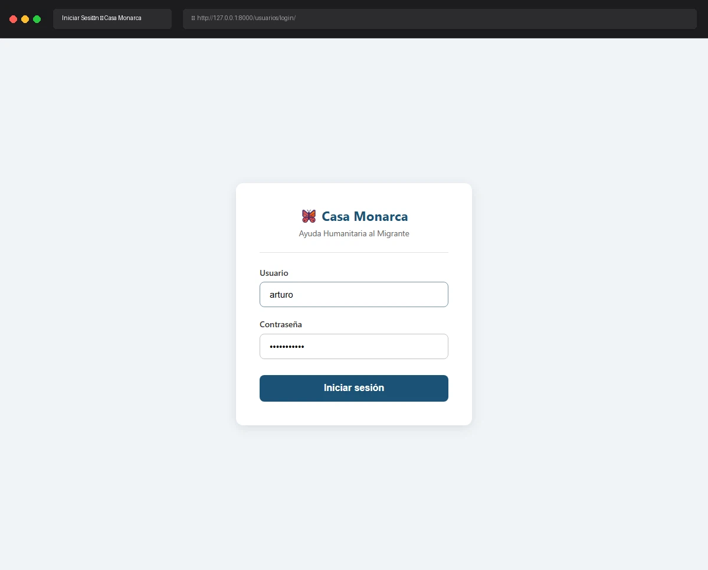

# Caso de Prueba: TC-01-03 — Login exitoso (Operativo)

| Campo | Valor |
|---|---|
| **Rol(es)** | Operativo |
| **Categoría** | 01 — Autenticación |
| **Metodología** | Login |
| **Fecha de ejecución** | 2026-05-28 |
| **Motor** | Playwright MCP (Claude Code) |
| **Estado** | ✅ PASS |

## Descripción
Login exitoso con credenciales válidas de Operativo. Verifica el redirect al Dashboard, el desbloqueo de la llave privada y la carga de la llave de rol Operativo (sin certificado X.509, que el rol no usa).

## Precondiciones
- Usuario `arturo` / `adminarturo` (rol `Operativo`).
- Servidor en `http://127.0.0.1:8000`; sin sesión previa.

## Pasos ejecutados
| # | Acción | Ubicación / Selector / Dato | Resultado esperado | Evidencia |
|---|---|---|---|---|
| 1 | Login como Operativo | `/usuarios/login/` · `arturo` / `adminarturo` | Dashboard con rol `Operativo`; RSA activas, sin certificado | `TC-01-03_paso-1.png` |
| 2 | Acceder a "Ver expedientes" | `/expediente/expedientes/` | La lista carga (sin logout forzado) → llave de rol Operativo desbloqueada | `TC-01-03_paso-2.png` |

## Resultado esperado
- Redirect a `/expediente/dashboard/`; rol `Operativo`.
- Panel cripto: **Llaves RSA: Activas** y **Certificado X.509: No emitido** (correcto: Operativo no usa firma).
- Acceso a la lista de expedientes (prueba de la llave de rol en caché).

## Resultado obtenido
- ✅ Dashboard; barra: `Arturo Camacho` · badge `Operativo`.
- ✅ Panel (snapshot): **Llaves RSA: Activas** · **Certificado X.509: No emitido**.
- ✅ `/expediente/expedientes/` cargó (título "Expedientes — Casa Monarca"), confirmando la llave de rol Operativo desbloqueada.

## Verificación en BD
No aplica.

## Evidencia

**Paso 1 — Dashboard del Operativo (RSA activas, sin certificado)**

**Paso 2 — Lista de expedientes descifrada (llave de rol Operativo activa)**

**Evidencia animada (corrida previa, conservada como resumen):**

## Conclusión
✅ **PASS.** El Operativo inicia sesión, desbloquea su llave de rol y accede a expedientes; correctamente no posee certificado X.509 (no requiere firma).
