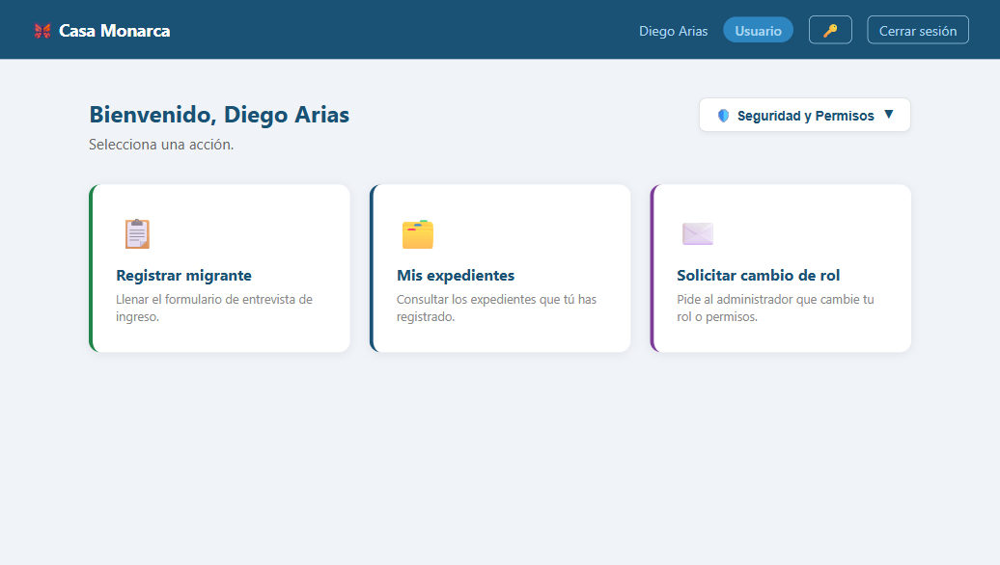
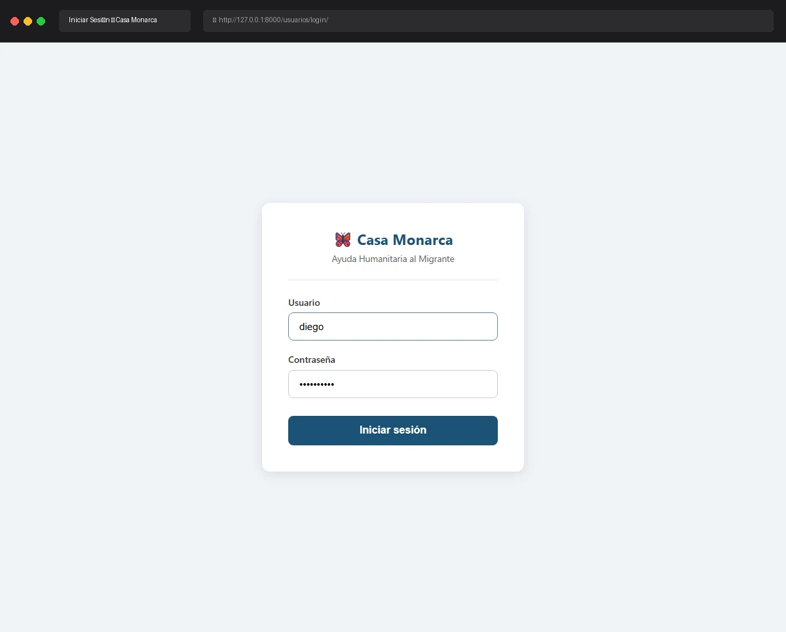

# Caso de Prueba: TC-01-04 — Login exitoso (Usuario)

| Campo | Valor |
|---|---|
| **Rol(es)** | Usuario |
| **Categoría** | 01 — Autenticación |
| **Metodología** | Login |
| **Fecha de ejecución** | 2026-05-28 |
| **Motor** | Playwright MCP (Claude Code) |
| **Estado** | ✅ PASS |

## Descripción
Login exitoso con credenciales válidas de Usuario. Verifica el redirect al Dashboard y que **NO se carga llave de rol** (el rol Usuario no tiene `LlaveRol` asociada).

## Precondiciones
- Usuario `diego` / `admindiego` (rol `Usuario`).
- Servidor en `http://127.0.0.1:8000`; sin sesión previa.

## Pasos ejecutados
| # | Acción | Ubicación / Selector / Dato | Resultado esperado | Evidencia |
|---|---|---|---|---|
| 1 | Login como Usuario | `/usuarios/login/` · `diego` / `admindiego` | Dashboard con rol `Usuario` y tarjeta "Mis expedientes" | `TC-01-04_paso-1.png` |
| 2 | Verificar ausencia de llave de rol | `manage.py shell` → `AccesoLlaveRol(usuario=diego).count()` | `0` accesos de rol | (salida de consola, abajo) |

## Resultado esperado
- Redirect a `/expediente/dashboard/`; rol `Usuario`.
- Panel cripto: **Llaves RSA: Activas** (par RSA personal) y **Certificado X.509: No emitido**.
- El Dashboard muestra **"Mis expedientes"** (no "Ver expedientes"), reflejando que el Usuario solo ve los propios.
- En BD, el Usuario **no** tiene registros `AccesoLlaveRol` (sin llave de rol).

## Resultado obtenido
- ✅ Dashboard; barra: `Diego Arias` · badge `Usuario`.
- ✅ Panel (snapshot): **Llaves RSA: Activas** · **Certificado X.509: No emitido**.
- ✅ Tarjeta **"Mis expedientes"** presente; permiso efectivo único: "Registrar expedientes nuevos".
- ✅ `AccesoLlaveRol` para `diego` = **0** (sin llave de rol).

## Verificación en BD
```python
AccesoLlaveRol.objects.filter(usuario__username='diego').count()
```
Resultado:
```
diego | rol: Usuario | activo: True | accesos_rol: 0
```

## Evidencia

**Paso 1 — Dashboard del Usuario (rol Usuario, tarjeta "Mis expedientes", sin certificado)**


**Evidencia animada (corrida previa, conservada como resumen):**


## Conclusión
✅ **PASS.** El Usuario inicia sesión y accede a su espacio ("Mis expedientes") con su par RSA personal; correctamente **no** se le carga ninguna llave de rol (0 registros `AccesoLlaveRol`), acorde a su nivel de acceso.
