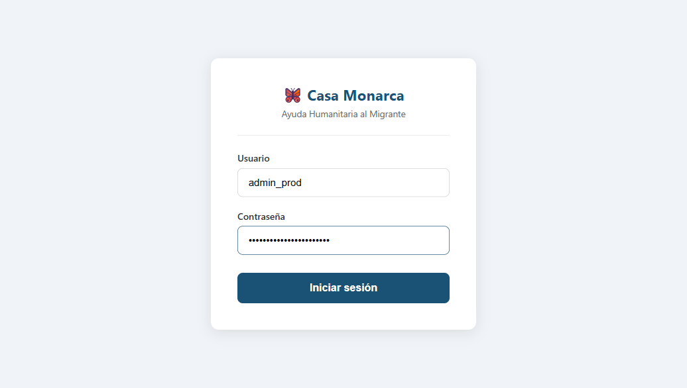
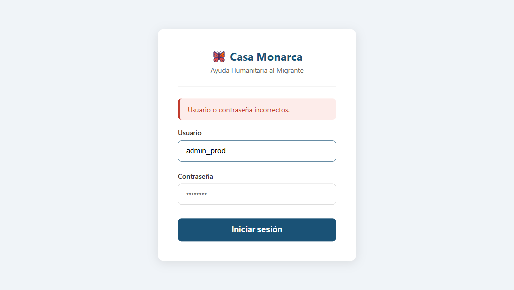
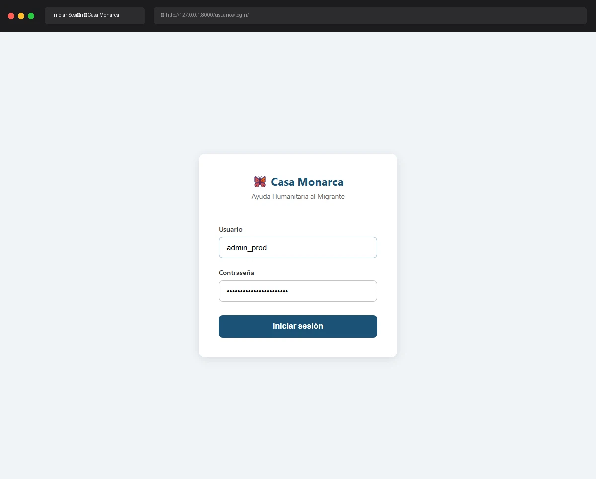

# Caso de Prueba: TC-01-05 — Login fallido con contraseña incorrecta

| Campo | Valor |
|---|---|
| **Rol(es)** | Administrador, Coordinador, Operativo, Usuario |
| **Categoría** | 01 — Autenticación |
| **Metodología** | Login |
| **Fecha de ejecución** | 2026-05-28 |
| **Motor** | Playwright MCP (Claude Code) |
| **Estado** | ✅ PASS |

## Descripción
Login fallido con un usuario válido pero contraseña incorrecta. Verifica que se muestra el mensaje de error y que no se crea sesión.

## Precondiciones
- Usuario `admin_prod` existente; se usa una contraseña **incorrecta**.
- Servidor en `http://127.0.0.1:8000`; sin sesión.

## Pasos ejecutados
| # | Acción | Ubicación / Selector / Dato | Resultado esperado | Evidencia |
|---|---|---|---|---|
| 1 | Capturar credenciales inválidas | `#id_username` = `admin_prod` · `#id_password` = `contraseñaIncorrecta123` | Campos completados | `TC-01-05_paso-1.png` |
| 2 | Enviar formulario | `button.btn-login` | Permanece en login con banner de error | `TC-01-05_paso-2.png` |

## Resultado esperado
- `authenticate()` falla → `messages.error(request, 'Usuario o contraseña incorrectos.')`.
- La URL sigue siendo `/usuarios/login/`; no se crea sesión.

## Resultado obtenido
- ✅ URL final: `/usuarios/login/` (sin redirect al Dashboard).
- ✅ Banner mostrado (verificado por snapshot): **"Usuario o contraseña incorrectos."**
- ✅ El campo de contraseña se limpió; no hay sesión activa.

## Verificación en BD
No aplica.

## Evidencia

**Paso 1 — Credenciales con contraseña incorrecta**

**Paso 2 — Banner "Usuario o contraseña incorrectos."**

**Evidencia animada (corrida previa, conservada como resumen):**

## Conclusión
✅ **PASS.** Con contraseña incorrecta el sistema rechaza el acceso, muestra el mensaje genérico y no crea sesión.
