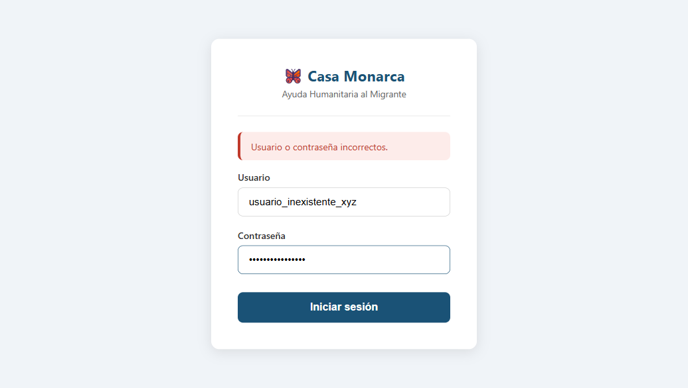
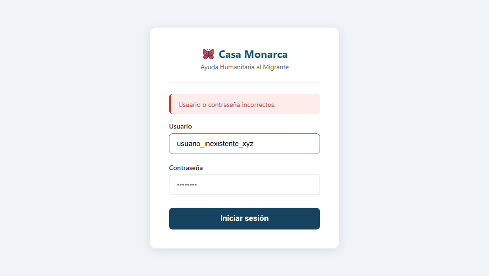

# Caso de Prueba: TC-01-06 — Login fallido con usuario inexistente

| Campo | Valor |
|---|---|
| **Rol(es)** | Administrador, Coordinador, Operativo, Usuario |
| **Categoría** | 01 — Autenticación |
| **Metodología** | Login |
| **Fecha de ejecución** | 2026-05-28 |
| **Motor** | Playwright MCP (Claude Code) |
| **Estado** | ✅ PASS |

## Descripción
Login fallido con un nombre de usuario inexistente. Verifica que se muestra un mensaje **genérico**, idéntico al de contraseña incorrecta, para no revelar si la cuenta existe (anti-enumeración).

## Precondiciones
- Usuario inexistente `usuario_inexistente_xyz`.
- Servidor en `http://127.0.0.1:8000`; sin sesión.

## Pasos ejecutados
| # | Acción | Ubicación / Selector / Dato | Resultado esperado | Evidencia |
|---|---|---|---|---|
| 1 | Capturar usuario inexistente | `#id_username` = `usuario_inexistente_xyz` · `#id_password` = `cualquierCosa123` | Campos completados | `TC-01-06_paso-1.png` |
| 2 | Enviar formulario | `button.btn-login` | Permanece en login con banner genérico | `TC-01-06_paso-2.png` |

## Resultado esperado
- `authenticate()` devuelve `None` → mismo mensaje `'Usuario o contraseña incorrectos.'`.
- URL sigue en `/usuarios/login/`; sin sesión.

## Resultado obtenido
- ✅ URL final: `/usuarios/login/`.
- ✅ Banner mostrado (verificado por snapshot): **"Usuario o contraseña incorrectos."** — **idéntico** al de TC-01-05, confirmando que no se filtra la existencia de cuentas.

## Verificación en BD
No aplica.

## Evidencia

**Paso 1 — Usuario inexistente capturado**

**Paso 2 — Banner genérico (mismo texto que con contraseña incorrecta)**

**Evidencia animada (corrida previa, conservada como resumen):**

## Conclusión
✅ **PASS.** El sistema responde con un mensaje genérico ante usuario inexistente, evitando la enumeración de cuentas.
