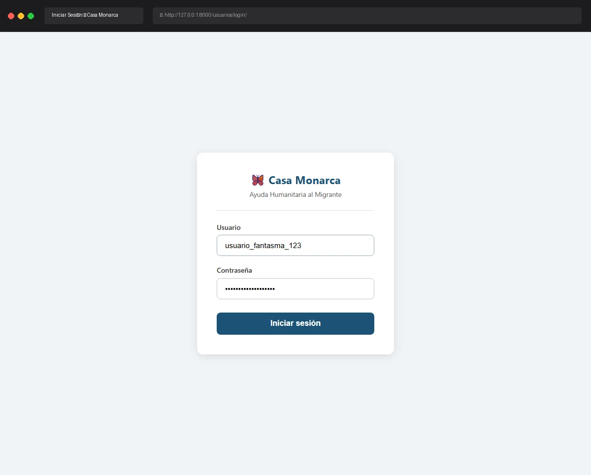

# Caso de Prueba: TC-01-06

**Rol:** Administrador, Coordinador, Operativo, Usuario  
**Descripción:** Login fallido con usuario inexistente. Verificar mensaje de error genérico (no revelar si el usuario existe).  
**Metodología:** Login  

## Evidencia de Ejecución

A continuación se muestra el video de la ejecución del caso de prueba usando Chromium:

## Pasos Realizados y Verificaciones

1. **Ingreso a Login:** Navegación a `http://127.0.0.1:8000/usuarios/login/`.
2. **Autenticación Fallida:** Se intentó iniciar sesión con un usuario inexistente: `usuario_fantasma_123`.
3. **Verificación de Error:** Se mostró correctamente el banner rojo con el mensaje de error: `"Usuario o contraseña incorrectos."`
4. **Verificación de Privacidad/Seguridad:** El mensaje de error es exactamente idéntico al que se muestra cuando la contraseña es incorrecta para un usuario existente, asegurando que no se revela la existencia o inexistencia de cuentas en el sistema.
