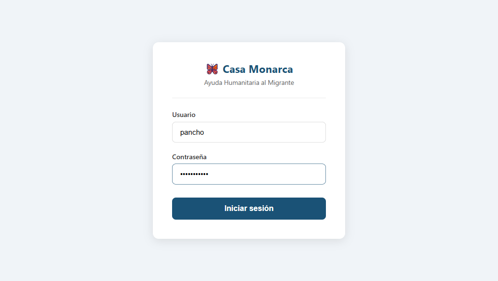
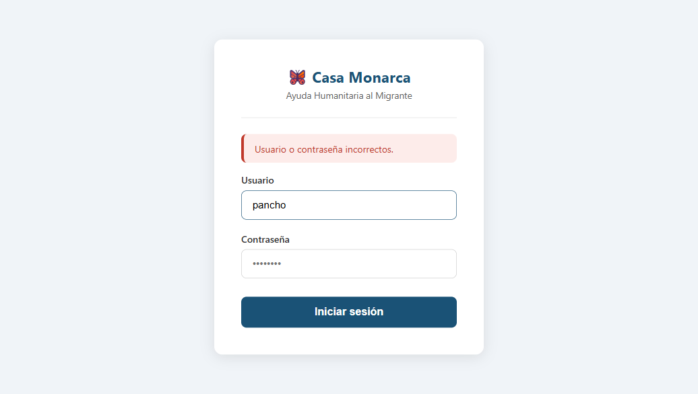
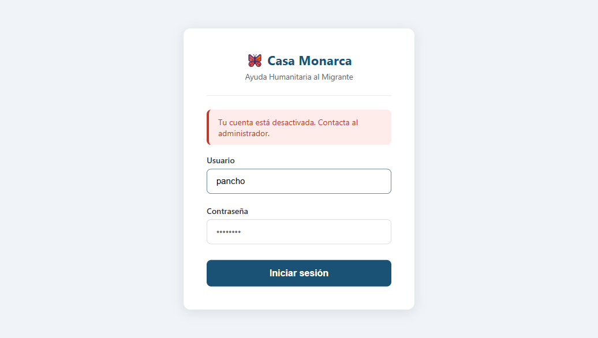
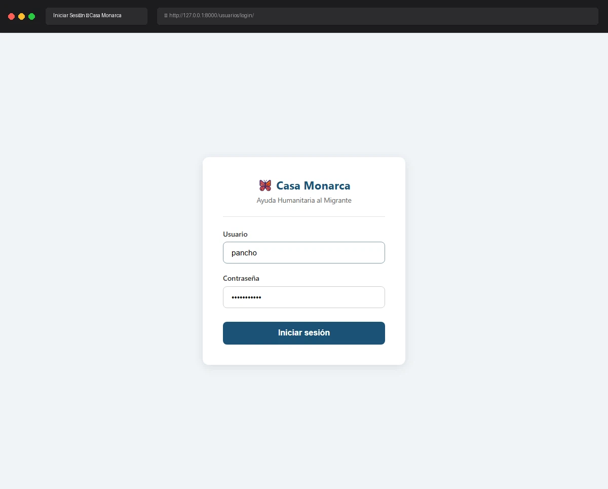

# Caso de Prueba: TC-01-07 — Login con cuenta desactivada

| Campo | Valor |
|---|---|
| **Rol(es)** | Administrador, Coordinador, Operativo, Usuario |
| **Categoría** | 01 — Autenticación |
| **Metodología** | Login |
| **Fecha de ejecución** | 2026-05-28 |
| **Motor** | Playwright MCP (Claude Code) |
| **Estado** | ✅ PASS (con hallazgo) |

## Descripción
Intento de login con una cuenta desactivada. Verifica que no se crea sesión. Se documentan **dos comportamientos** según el estado de los flags `activo` (campo propio) e `is_active` (Django).

## Precondiciones
- Usuario `pancho` / `adminpancho` (contraseña válida).
- Servidor en `http://127.0.0.1:8000`; sin sesión.

## Pasos ejecutados
| # | Acción | Ubicación / Selector / Dato | Resultado esperado | Evidencia |
|---|---|---|---|---|
| 1 | Login con cuenta desactivada real (`activo=False`, `is_active=False`) | `/usuarios/login/` · `pancho` / `adminpancho` | Acceso denegado, sin sesión | `TC-01-07_paso-1.png` |
| 2 | Observar mensaje | — | Banner de error mostrado | `TC-01-07_paso-2.png` |
| 3 | Forzar la rama explícita (`is_active=True`, `activo=False`) y reintentar | `manage.py shell` + login | Mensaje "Tu cuenta está desactivada…" | `TC-01-07_paso-3.png` |

## Resultado esperado
- En ningún caso se crea sesión ni se accede al Dashboard.
- Mensaje esperado por el caso: **"Tu cuenta está desactivada. Contacta al administrador."**

## Resultado obtenido
- ✅ **Cuenta desactivada estándar (ambos flags en False):** el sistema muestra **"Usuario o contraseña incorrectos."** y no crea sesión. Esto ocurre porque el backend de Django (`ModelBackend.user_can_authenticate`) rechaza usuarios con `is_active=False` devolviendo `None` **antes** de evaluar el campo `activo` en la vista.
- ✅ **Rama explícita (`is_active=True`, `activo=False`):** `authenticate()` devuelve el usuario y la vista entra a `else: messages.error('Tu cuenta está desactivada. Contacta al administrador.')`. El banner exacto se mostró y **no** se creó sesión.

## Verificación en BD
```
Estado real de pancho: activo=False, is_active=False   → mensaje genérico
Estado forzado (prueba): activo=False, is_active=True   → "Tu cuenta está desactivada…"
(pancho fue restaurado a activo=False, is_active=False tras la prueba)
```

## Hallazgo
> El mensaje específico **"Tu cuenta está desactivada. Contacta al administrador."** solo es alcanzable cuando `is_active=True` y `activo=False`. Como `toggle_activo` ([usuarios/views.py](../../usuarios/views.py)) sincroniza **ambos** flags al desactivar, en la práctica una cuenta desactivada desde el panel muestra el mensaje **genérico**. Recomendación opcional: si se desea el mensaje explícito, evaluar `activo` en el backend o no apagar `is_active`. La seguridad (no crear sesión) se cumple en ambos casos.

## Evidencia

**Paso 1 — Intento de login con cuenta desactivada (`pancho`)**


**Paso 2 — Cuenta desactivada estándar → mensaje genérico**


**Paso 3 — Rama explícita (`is_active=True`) → "Tu cuenta está desactivada. Contacta al administrador."**


**Evidencia animada (corrida previa, conservada como resumen):**


## Conclusión
✅ **PASS.** Una cuenta desactivada nunca obtiene sesión. Se documentan los dos mensajes posibles y se deja constancia del hallazgo sobre la condición que dispara el mensaje explícito de desactivación.
