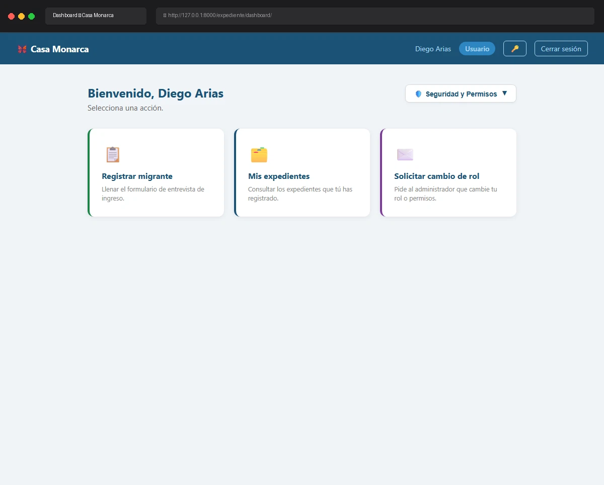

# Caso de Prueba: TC-01-09 — Logout exitoso

| Campo | Valor |
|---|---|
| **Rol(es)** | Administrador, Coordinador, Operativo, Usuario |
| **Categoría** | 01 — Autenticación |
| **Metodología** | Dashboard — Logout — Login |
| **Fecha de ejecución** | 2026-05-28 |
| **Motor** | Playwright MCP (Claude Code) |
| **Estado** | ✅ PASS |

## Descripción
Cierre de sesión exitoso. Verifica que se registra un evento `tipo='logout'` en la bitácora de auditoría y que el usuario es redirigido a la página de Login.

## Precondiciones
- Sesión activa de `admin_prod` (continuación de TC-01-12).
- Servidor en `http://127.0.0.1:8000`.

## Pasos ejecutados
| # | Acción | Ubicación / Selector / Dato | Resultado esperado | Evidencia |
|---|---|---|---|---|
| 1 | Confirmar Dashboard | `/expediente/dashboard/` | Barra con enlace "Cerrar sesión" visible | `TC-01-09_paso-1.png` |
| 2 | Cerrar sesión | `a.btn-logout[href="/usuarios/logout/"]` | Redirect a `/usuarios/login/` | `TC-01-09_paso-2.png` |
| 3 | Verificar bitácora | `manage.py shell` → `BitacoraEvento(tipo='logout')` | Registro creado con usuario, descripción e IP | (salida de consola, abajo) |

## Resultado esperado
- Tras el clic en "Cerrar sesión", redirect a `/usuarios/login/`.
- Se crea un `BitacoraEvento` con `tipo='logout'`, `descripcion="Cierre de sesión de admin_prod"`, `ip` del cliente.

## Resultado obtenido
- ✅ URL final: `http://127.0.0.1:8000/usuarios/login/` (formulario de login mostrado).
- ✅ Registro en bitácora confirmado vía ORM.

## Verificación en BD
Consulta:
```python
BitacoraEvento.objects.filter(tipo='logout').order_by('-id').first()
```
Resultado:
```
ID: 411 | tipo: logout | desc: Cierre de sesión de admin_prod | ip: 127.0.0.1 | fecha: 2026-05-29 04:55:29 UTC
```

## Evidencia

**Paso 1 — Dashboard con sesión activa (antes del logout)**


**Paso 2 — Redirect a la pantalla de Login tras cerrar sesión**


**Evidencia animada (corrida previa, conservada como resumen):**


## Conclusión
✅ **PASS.** El logout cierra la sesión, redirige al Login y deja constancia auditable (`tipo='logout'`) en la bitácora encadenada.
