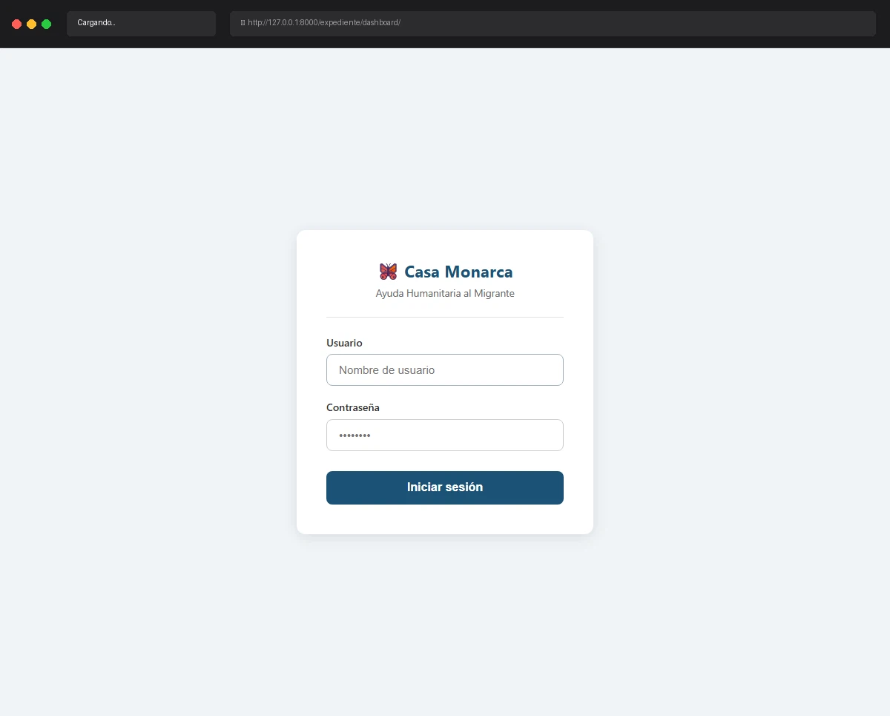

# Caso de Prueba: TC-01-10

**Rol:** Administrador, Coordinador, Operativo, Usuario  
**Descripción:** Acceso a Dashboard sin estar autenticado. Verificar redirect automático a Login.  
**Metodología:** Dashboard (directo sin sesión)  

## Evidencia de Ejecución

A continuación se muestra el video de la ejecución del caso de prueba usando Chromium:

## Pasos Realizados y Verificaciones

1. **Cierre de sesión:** Se aseguró que no hubiera ninguna sesión activa de usuario en el navegador.
2. **Acceso directo sin sesión:** Se intentó ingresar directamente a la URL de Dashboard (`http://127.0.0.1:8000/expediente/dashboard/`).
3. **Verificación de Redirección:** El sistema denegó el acceso automáticamente debido al decorador `@login_required` (o lógica de verificación de sesión) y redirigió de inmediato a la pantalla de inicio de sesión (`http://127.0.0.1:8000/usuarios/login/`).
4. **Verificación visual:** El usuario no pudo visualizar ningún componente ni dato del Dashboard.
