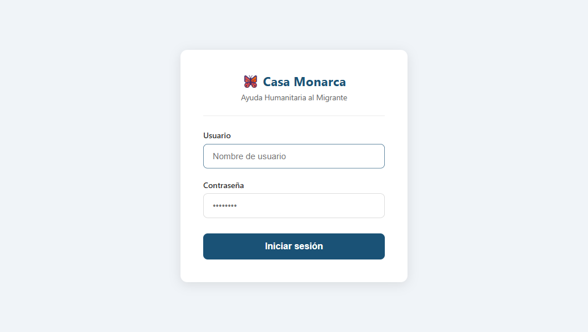
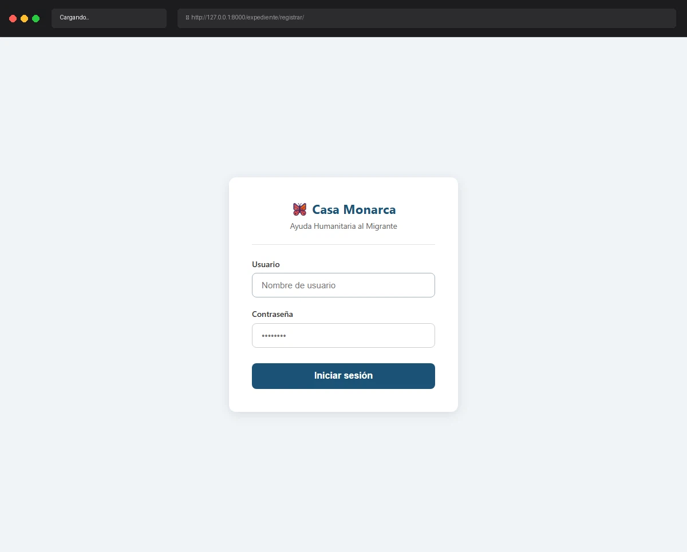

# Caso de Prueba: TC-01-11 — Acceso a ruta protegida sin sesión

| Campo | Valor |
|---|---|
| **Rol(es)** | Administrador, Coordinador, Operativo, Usuario |
| **Categoría** | 01 — Autenticación |
| **Metodología** | Cualquier ruta protegida (acceso directo sin sesión) |
| **Fecha de ejecución** | 2026-05-28 |
| **Motor** | Playwright MCP (Claude Code) |
| **Estado** | ✅ PASS |

## Descripción
Intento de acceso a una ruta protegida (lista de expedientes) sin autenticación. Verifica que el decorador `@login_required` redirige al Login.

## Precondiciones
- Sin sesión activa.
- Servidor en `http://127.0.0.1:8000`.

## Pasos ejecutados
| # | Acción | Ubicación / Selector / Dato | Resultado esperado | Evidencia |
|---|---|---|---|---|
| 1 | Acceder a ruta protegida sin sesión | Navegar a `/expediente/expedientes/` | Redirect a Login con `?next=` | `TC-01-11_paso-1.png` |

## Resultado esperado
- `@login_required` redirige a `LOGIN_URL` preservando el destino.
- URL resultante: `/usuarios/login/?next=/expediente/expedientes/`; sin contenido de la lista de expedientes.

## Resultado obtenido
- ✅ URL final: `http://127.0.0.1:8000/usuarios/login/?next=/expediente/expedientes/`.
- ✅ Se mostró el formulario de Login; ningún dato de expedientes fue visible.

## Verificación en BD
No aplica.

## Evidencia

**Paso 1 — Redirect a Login con `?next=/expediente/expedientes/`**

**Evidencia animada (corrida previa, conservada como resumen):**

## Conclusión
✅ **PASS.** Cualquier ruta protegida exige sesión: sin autenticación, `@login_required` redirige al Login conservando el destino en `?next=`.
