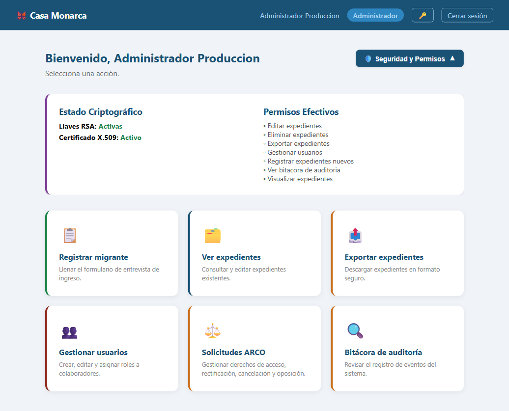
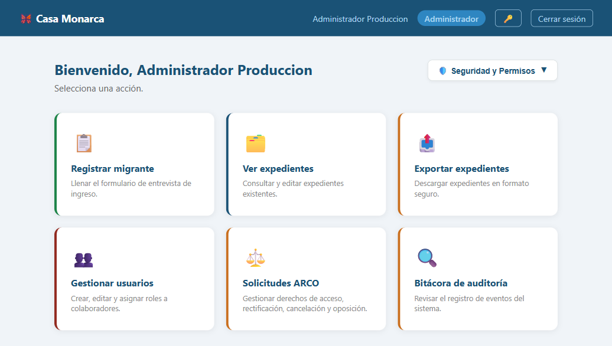

# Caso de Prueba: TC-01-12 — Login estando ya autenticado

| Campo | Valor |
|---|---|
| **Rol(es)** | Administrador, Coordinador, Operativo, Usuario |
| **Categoría** | 01 — Autenticación |
| **Metodología** | Login (ya autenticado) |
| **Fecha de ejecución** | 2026-05-28 |
| **Motor** | Playwright MCP (Claude Code) |
| **Estado** | ✅ PASS |

## Descripción
Acceso a la pantalla de login cuando el usuario ya tiene una sesión activa. Se verifica que el sistema redirige directamente al Dashboard sin volver a mostrar el formulario de inicio de sesión.

## Precondiciones
- Sesión activa (se reutiliza la sesión de `admin_prod` iniciada en TC-01-01).
- Servidor en `http://127.0.0.1:8000`.

## Pasos ejecutados
| # | Acción | Ubicación / Selector / Dato | Resultado esperado | Evidencia |
|---|---|---|---|---|
| 1 | Confirmar sesión activa | `/expediente/dashboard/` | Dashboard visible con la sesión iniciada | `TC-01-12_paso-1.png` |
| 2 | Intentar abrir el login | Navegar a `/usuarios/login/` | Redirect automático al Dashboard, sin formulario | `TC-01-12_paso-2.png` |

## Resultado esperado
- Al solicitar `/usuarios/login/` con sesión activa, `login_view` ejecuta `if request.user.is_authenticated: redirect('expediente:dashboard')`.
- La URL resultante es `/expediente/dashboard/` y **no** se muestra el formulario (`#id_username` ausente).

## Resultado obtenido
- ✅ Tras navegar a `/usuarios/login/`, la URL final fue `http://127.0.0.1:8000/expediente/dashboard/`.
- ✅ Se mostró el Dashboard (título "Dashboard — Casa Monarca"); no apareció el formulario de login.

## Verificación en BD
No aplica.

## Evidencia

**Paso 1 — Sesión activa en el Dashboard**

**Paso 2 — Redirect automático al Dashboard al intentar abrir el login**

**Evidencia animada (corrida previa, conservada como resumen):**

## Conclusión
✅ **PASS.** Estando autenticado, el acceso a la pantalla de login redirige de inmediato al Dashboard sin reexponer el formulario, evitando reinicios de sesión innecesarios.
