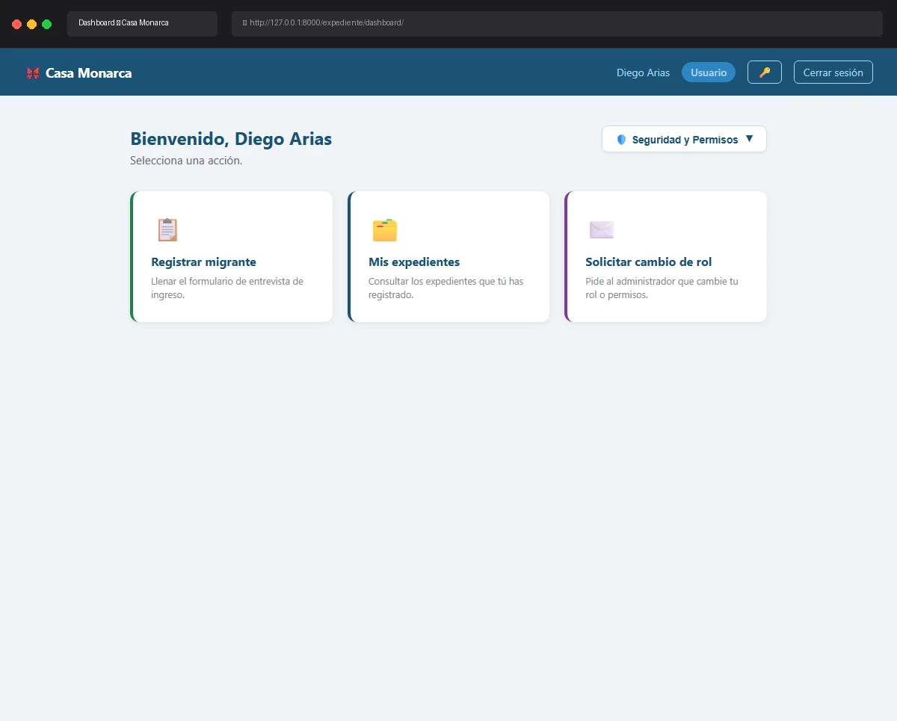

# Caso de Prueba: TC-01-12

**Rol:** Administrador, Coordinador, Operativo, Usuario  
**Descripción:** Login exitoso cuando el usuario ya está autenticado. Verificar que se redirige directamente al Dashboard sin mostrar el formulario de login.  
**Metodología:** Login (ya autenticado)  

## Evidencia de Ejecución

A continuación se muestra el video de la ejecución del caso de prueba usando Chromium:

## Pasos Realizados y Verificaciones

1. **Autenticación inicial:** Se inició sesión con el usuario `diego` (password: `admindiego`) y se confirmó su redirección al Dashboard.
2. **Acceso al Login ya autenticado:** Estando autenticado, se intentó ingresar a la URL de Login (`http://127.0.0.1:8000/usuarios/login/`) escribiendo directamente la dirección en el navegador.
3. **Verificación de Redirección:** El sistema, detectando que la sesión ya está activa, evitó mostrar el formulario de inicio de sesión y redirigió automáticamente al usuario de vuelta al Dashboard (`http://127.0.0.1:8000/expediente/dashboard/`).
4. **Validación visual:** Se confirmó que la pantalla final cargada corresponde al Dashboard sin solicitar credenciales nuevamente.
