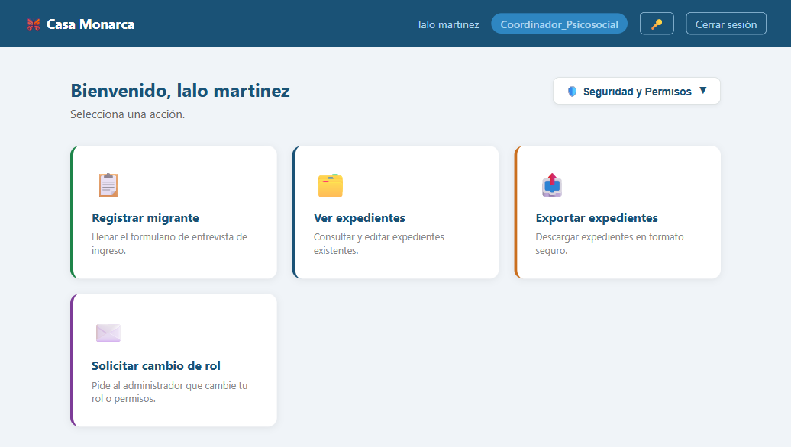
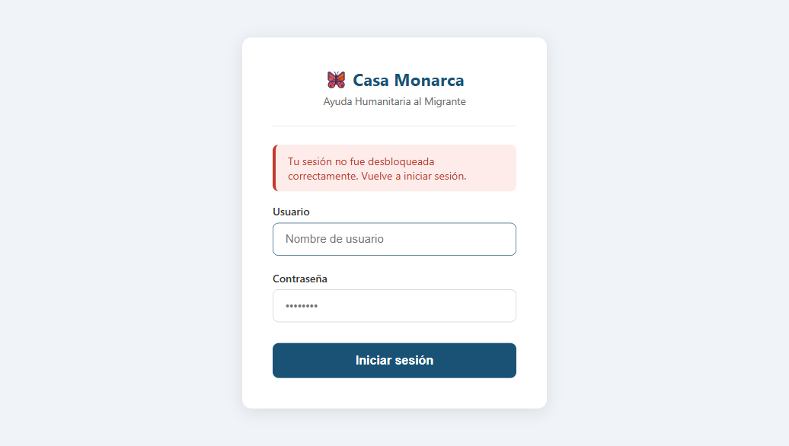
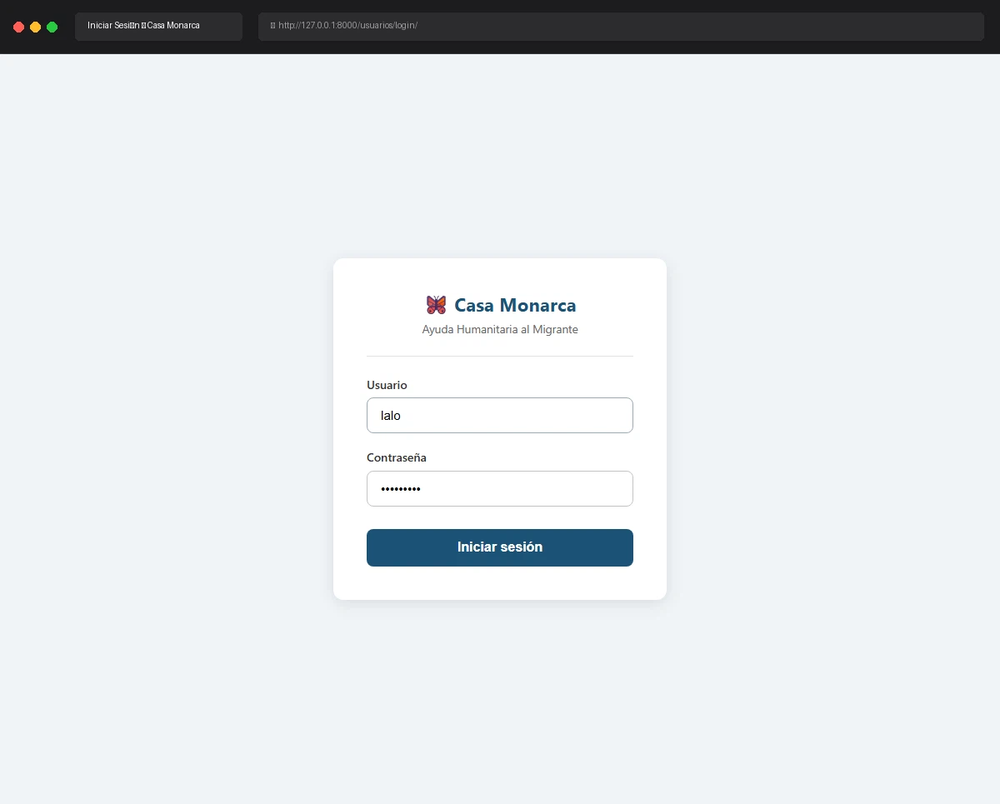

# Caso de Prueba: TC-01-13 — Login con llave privada corrupta

| Campo | Valor |
|---|---|
| **Rol(es)** | Coordinador, Administrador |
| **Categoría** | 01 — Autenticación |
| **Metodología** | Login (llave privada corrupta) |
| **Fecha de ejecución** | 2026-05-28 |
| **Motor** | Playwright MCP (Claude Code) + manipulación controlada de BD |
| **Estado** | ✅ PASS |

## Descripción
Simula una llave privada corrupta (o salt inválido) en BD. Verifica que el login de Django **procede** (autenticación por hash de contraseña), pero la sesión criptográfica queda **vacía** (sin `_llave_privada_cache` ni `_llaves_rol_cache`), de modo que el usuario **no puede descifrar expedientes** y es expulsado al intentar una ruta protegida por rol.

## Precondiciones
- Usuario `lalo` / `adminlalo` (rol `Coordinador_Psicosocial`).
- Se respaldó la `llave_privada` original (2276 chars) y se reemplazó por el valor inválido `'invalid_corrupt_private_key'` vía `manage.py shell`. **Restaurada al finalizar.**

## Pasos ejecutados
| # | Acción | Ubicación / Selector / Dato | Resultado esperado | Evidencia |
|---|---|---|---|---|
| 1 | Corromper llave en BD | `manage.py shell` → `lalo.llave_privada='invalid_corrupt_private_key'` | Llave inválida persistida (con respaldo) | (consola, abajo) |
| 2 | Login con llave corrupta | `/usuarios/login/` · `lalo` / `adminlalo` | Login procede → Dashboard, pero sin caché criptográfica | `TC-01-13_paso-1.png` |
| 3 | Acceder a "Ver expedientes" | `/expediente/expedientes/` | Logout forzado + redirect a Login con aviso | `TC-01-13_paso-2.png` |
| 4 | Restaurar llave original | `manage.py shell` (restore desde respaldo) | Llave restaurada (2276 chars) | (consola, abajo) |

## Resultado esperado
- El login de Django tiene éxito (hash de contraseña válido) y redirige al Dashboard.
- `descifrar_llave_con_password` lanza `ValueError` (capturado) → `_llave_privada_cache` no se establece.
- Al pedir una ruta `@rol_requerido`, la ausencia de la llave de rol en caché provoca **logout forzado** y redirect a `/usuarios/login/` con un banner de seguridad.

## Resultado obtenido
- ✅ `lalo` autenticó y llegó al Dashboard pese a la llave corrupta (paso 2).
- ✅ Al navegar a `/expediente/expedientes/`, el sistema cerró la sesión y redirigió a `/usuarios/login/` mostrando: **"Tu sesión no fue desbloqueada correctamente. Vuelve a iniciar sesión."**
- ✅ Llave original restaurada (longitud 2276 idéntica a la respaldada); integridad del entorno de desarrollo preservada.

## Verificación en BD
```
Respaldo: backup_len: 2276  → corrompida a 'invalid_corrupt_private_key'
Restauración: restaurada len: 2276  → backup eliminado
```

## Evidencia

**Paso 1 — Login con llave corrupta: el acceso de Django procede hasta el Dashboard**


**Paso 2 — Al abrir "Ver expedientes", logout forzado con aviso de sesión criptográfica no desbloqueada**


**Evidencia animada (corrida previa, conservada como resumen):**


## Conclusión
✅ **PASS.** Una llave privada corrupta no rompe el login de Django, pero la sesión criptográfica queda vacía; el control `@rol_requerido` detecta la ausencia de llave de rol y expulsa al usuario de forma segura, impidiendo el acceso a datos cifrados.
