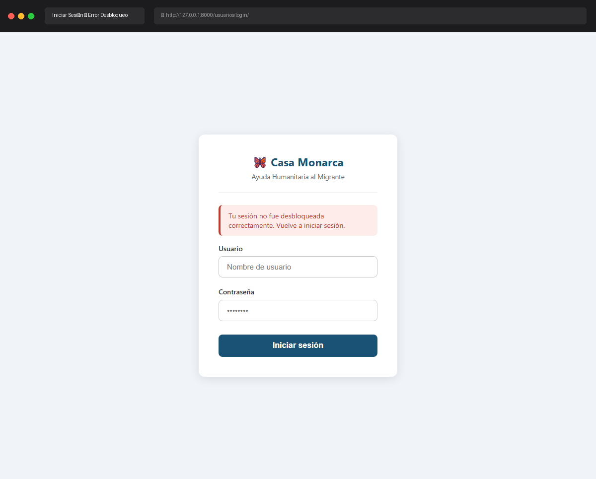

# Caso de Prueba: TC-01-13

**Rol:** Coordinador, Administrador  
**Descripción:** Login con llave privada corrupta o salt inválido. Verificar que el login Django procede pero la sesión criptográfica queda vacía (sin `_llave_privada_cache`). El usuario no podrá descifrar expedientes.  
**Metodología:** Login  

## Evidencia de Ejecución

A continuación se muestra el video de la ejecución del caso de prueba usando Chromium:

Al intentar visualizar la lista de expedientes (lo cual requiere que la llave privada esté en el cache de la sesión), el usuario es redirigido inmediatamente a la pantalla de Login mostrando el siguiente banner de error debido a que la sesión criptográfica quedó vacía:

## Pasos Realizados y Verificaciones

1. **Corrupción de Llave Privada en Base de Datos:** Para simular este escenario sin alterar el código fuente de autenticación de Django, se corrompió de forma intencionada la llave privada del Coordinador `lalo` en la base de datos a un valor inválido (`'invalid_corrupt_private_key'`).
2. **Autenticación (Login exitoso en Django):** Se intentó iniciar sesión con las credenciales válidas de `lalo` (password: `adminlalo`). Dado que la autenticación de Django se basa en hashes estándar de contraseñas, el login en Django procedió exitosamente y redirigió al usuario al Dashboard.
3. **Fallo en Descifrado Automático:** Durante el login, el servidor intentó descifrar la llave privada RSA del usuario utilizando la contraseña ingresada y el salt de login. Al estar la llave corrupta en la base de datos, esta operación arrojó un error (`ValueError`), que es capturado silenciosamente. Como resultado, la variable de sesión `_llave_privada_cache` quedó completamente vacía.
4. **Intento de Acceso a Expedientes:** Desde el Dashboard, se hizo clic en `"Ver expedientes"`.
5. **Verificación de Redirección y Error:** La vista protegida `lista_expedientes` constató la ausencia de la llave en `request.session.get('_llave_privada_cache')`. Por lo tanto, denegó el acceso, cerró la sesión activa de Django (`logout`) y redirigió al usuario a la pantalla de Login con el banner seguro `"Tu sesión no fue desbloqueada correctamente. Vuelve a iniciar sesión."`.
6. **Restauración:** Se restauraron los datos originales del usuario `lalo` en la base de datos para preservar la integridad del sistema de desarrollo.
