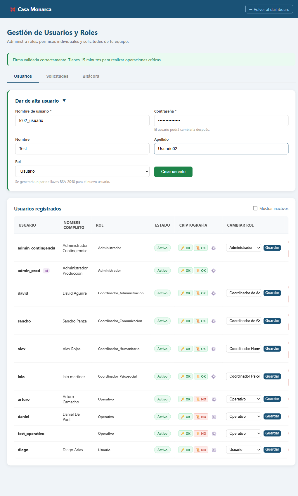
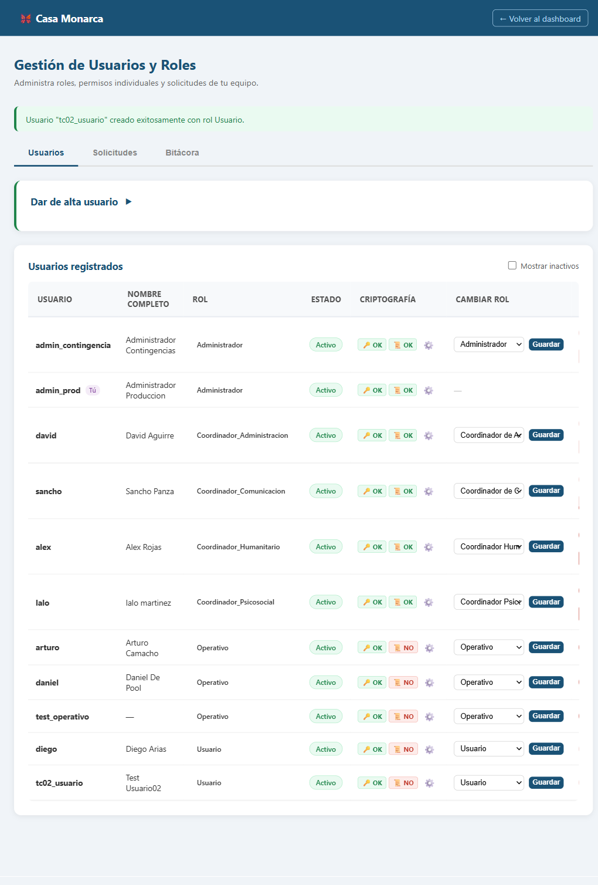

# Caso de Prueba: TC-02-01 — Crear usuario con rol Usuario

| Campo | Valor |
|---|---|
| **Rol(es)** | Administrador (ejecutor) |
| **Categoría** | 02 — Gestión de Usuarios |
| **Metodología** | Login — Ingresar Firma — Admin Panel — Crear usuario |
| **Fecha de ejecución** | 2026-05-29 |
| **Motor** | Playwright MCP (Claude Code) + verificación ORM |
| **Estado** | ✅ PASS |

## Descripción
Creación de un usuario con rol **Usuario**. Verifica que se genera par RSA-2048 (`llave_publica`/`llave_privada`), `salt_login`, y la llave privada cifrada; **NO** se genera certificado X.509, archivo `.key` ni llave de rol.

## Precondiciones
- Sesión de `admin_prod` con **firma cargada** (`.key` válido en sesión, vigente 15 min).
- Admin Panel abierto (`/usuarios/admin-panel/`).

## Pasos ejecutados
| # | Acción | Ubicación / Selector / Dato | Resultado esperado | Evidencia |
|---|---|---|---|---|
| 1 | Abrir y llenar "Dar de alta usuario" | `#new_username`=`tc02_usuario` · `#new_password`=`ClaveSegura2026` · `#new_rol`=`Usuario` | Formulario completo | `TC-02-01_paso-1.png` |
| 2 | Crear usuario | `#create-form form` → submit (`crear_usuario`) | Mensaje de éxito + usuario en la tabla | `TC-02-01_paso-2.png` |
| 3 | Verificar en BD | `manage.py shell` | RSA + salt sí; cert + llave de rol no | (consola, abajo) |

## Resultado esperado
- Mensaje: **"Usuario \"tc02_usuario\" creado exitosamente con rol Usuario."**
- BD: `llave_publica`, `llave_privada` (cifrada) y `salt_login` presentes; `certificado_digital` nulo; **0** `AccesoLlaveRol`.

## Resultado obtenido
- ✅ Mensaje mostrado: **"Usuario \"tc02_usuario\" creado exitosamente con rol Usuario."**
- ✅ Usuario `tc02_usuario` aparece en la tabla con badge **Usuario**, **Activo**, Criptografía **🔑 OK / 📜 NO**.
- ✅ BD: `llave_publica=True`, `llave_privada=True`, `salt_login=True`, `certificado_digital=False`, `accesos_rol=0`.

## Verificación en BD
```
existe: True
rol: Usuario | llave_publica: True | llave_privada: True | salt_login: True
certificado_digital: False | accesos_rol: 0
```

## Evidencia

**Paso 1 — Formulario "Dar de alta usuario" con rol Usuario**


**Paso 2 — Usuario creado (mensaje de éxito + fila en la tabla)**


**Evidencia animada (corrida previa, conservada como resumen):**


## Conclusión
✅ **PASS.** El rol Usuario se crea con su par RSA-2048 y `salt_login`, sin certificado X.509 ni llave de rol, acorde a su nivel de acceso mínimo.
