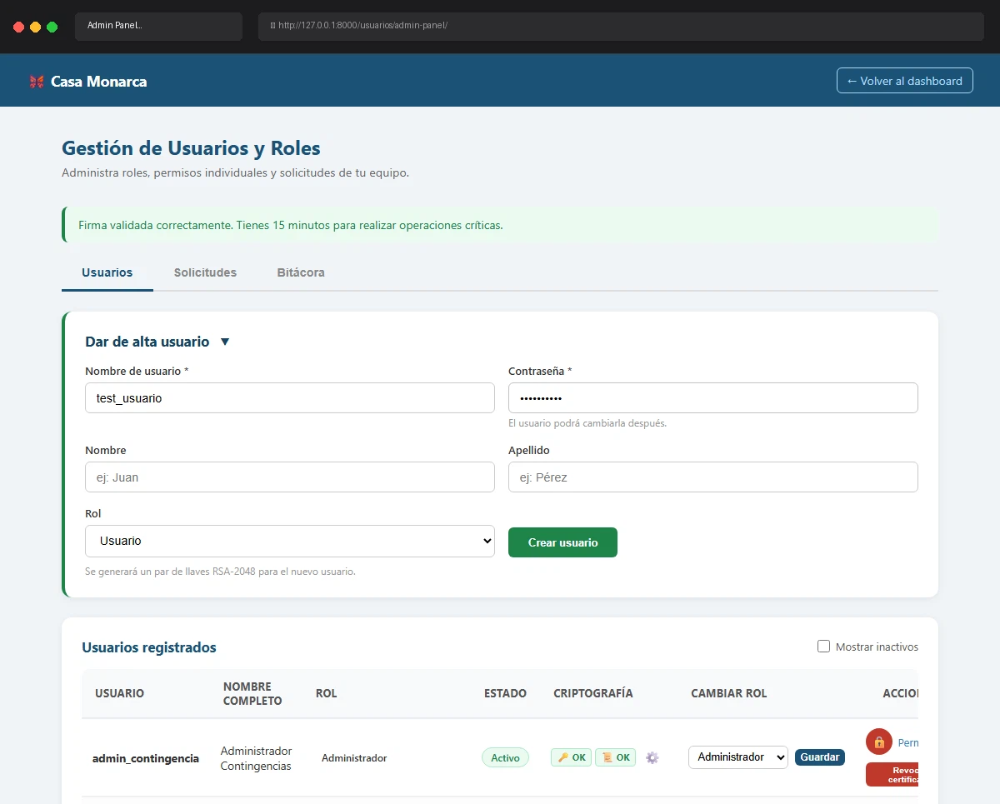

# Caso de Prueba TC-02-01

**Roles:** Administrador
**Descripción:** Crear usuario con rol Usuario. Verificar que se genera par RSA-2048, salt_login, llave_privada cifrada. NO se genera certificado X.509 ni archivo .key.
**Metodología:** Login — Ingresar Firma — Admin Panel (tab Usuarios) — Crear usuario

## Evidencia de Ejecución

A continuación se muestra el video de la ejecución del caso de prueba:

## Pasos Realizados y Verificaciones

1. (La evidencia animada documenta los pasos visuales).
