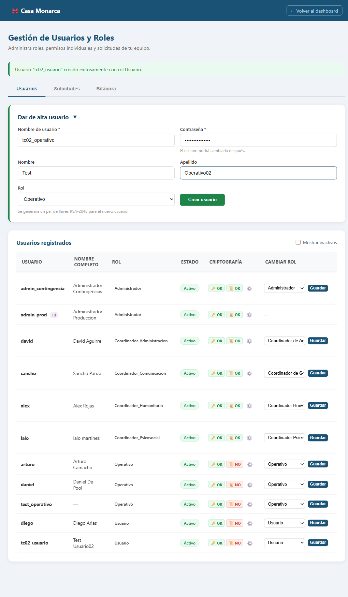
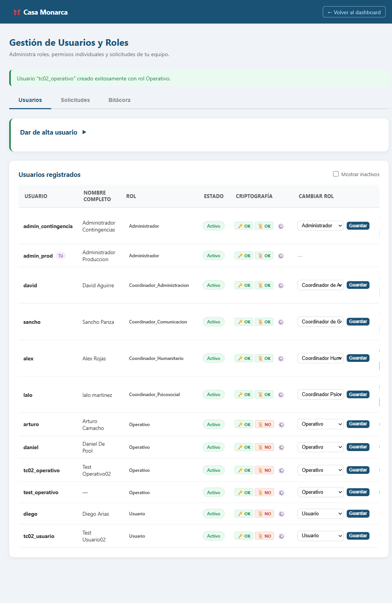
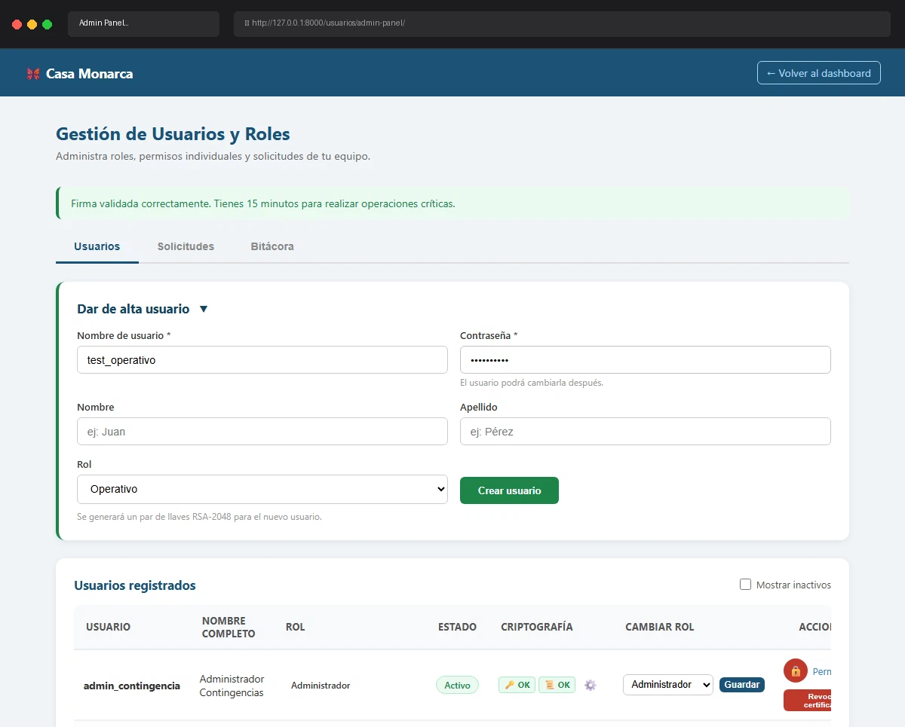

# Caso de Prueba: TC-02-02 — Crear usuario con rol Operativo

| Campo | Valor |
|---|---|
| **Rol(es)** | Administrador (ejecutor) |
| **Categoría** | 02 — Gestión de Usuarios |
| **Metodología** | Login — Ingresar Firma — Admin Panel — Crear usuario |
| **Fecha de ejecución** | 2026-05-29 |
| **Motor** | Playwright MCP (Claude Code) + verificación ORM |
| **Estado** | ✅ PASS |

## Descripción
Creación de un usuario con rol **Operativo**. Verifica que se genera par RSA-2048 **y** una llave de rol (`AccesoLlaveRol`); **NO** se genera certificado X.509 ni archivo `.key`.

## Precondiciones
- Sesión de `admin_prod` con firma cargada (vigente 15 min).
- Admin Panel abierto.

## Pasos ejecutados
| # | Acción | Ubicación / Selector / Dato | Resultado esperado | Evidencia |
|---|---|---|---|---|
| 1 | Llenar "Dar de alta usuario" con rol Operativo | `#new_username`=`tc02_operativo` · `#new_password`=`ClaveSegura2026` · `#new_rol`=`Operativo` | Formulario completo | `TC-02-02_paso-1.png` |
| 2 | Crear usuario | `#create-form form` → submit | Mensaje de éxito + usuario en la tabla | `TC-02-02_paso-2.png` |
| 3 | Verificar en BD | `manage.py shell` | RSA + salt + 1 llave de rol; sin cert | (consola, abajo) |

## Resultado esperado
- Mensaje: **"Usuario \"tc02_operativo\" creado exitosamente con rol Operativo."**
- BD: RSA + `salt_login`; `certificado_digital` nulo; **1** `AccesoLlaveRol` (llave del rol Operativo).

## Resultado obtenido
- ✅ Mensaje: **"Usuario \"tc02_operativo\" creado exitosamente con rol Operativo."**
- ✅ Fila en tabla con badge **Operativo**, Criptografía **🔑 OK / 📜 NO**.
- ✅ BD: `llave_publica=True`, `llave_privada=True`, `salt_login=True`, `certificado_digital=False`, `accesos_rol=1`.

## Verificación en BD
```
existe: True
rol: Operativo | llave_publica: True | llave_privada: True | salt_login: True
certificado_digital: False | accesos_rol: 1
```

## Evidencia

**Paso 1 — Formulario con rol Operativo**


**Paso 2 — Operativo creado (mensaje de éxito + fila en la tabla)**


**Evidencia animada (corrida previa, conservada como resumen):**


## Conclusión
✅ **PASS.** El rol Operativo se crea con par RSA-2048 y su llave de rol (para descifrar expedientes), sin certificado X.509 (no firma operaciones críticas).
