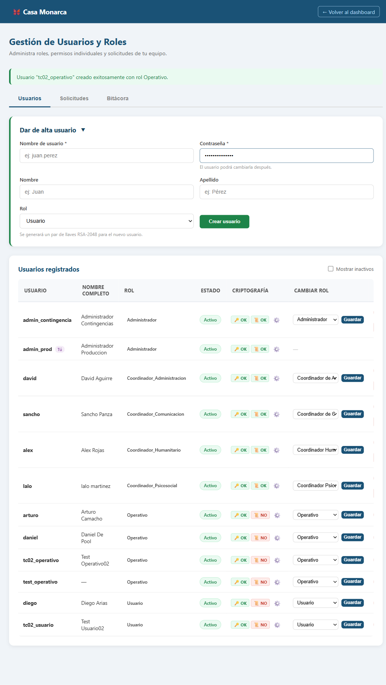
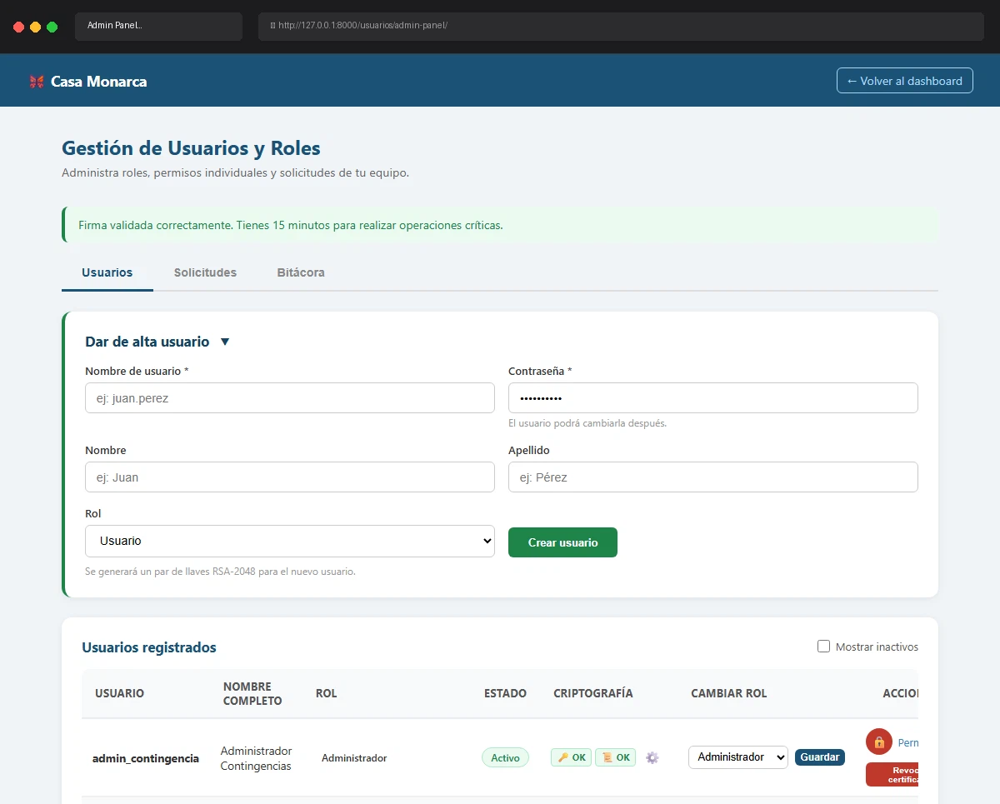

# Caso de Prueba: TC-02-05 — Crear usuario sin nombre de usuario

| Campo | Valor |
|---|---|
| **Rol(es)** | Administrador (ejecutor) |
| **Categoría** | 02 — Gestión de Usuarios |
| **Metodología** | Login — Ingresar Firma — Admin Panel — Crear usuario |
| **Fecha de ejecución** | 2026-05-29 |
| **Motor** | Playwright MCP (Claude Code) |
| **Estado** | ✅ PASS |

## Descripción
Intento de crear un usuario **sin nombre de usuario** (solo contraseña). Verifica el mensaje de error de obligatoriedad y que no se crea ningún usuario. Se omitió la validación HTML5 (`required`) enviando el formulario por JavaScript para alcanzar la validación de servidor.

## Precondiciones
- Sesión de `admin_prod` con firma cargada; Admin Panel abierto.

## Pasos ejecutados
| # | Acción | Ubicación / Selector / Dato | Resultado esperado | Evidencia |
|---|---|---|---|---|
| 1 | Llenar solo contraseña (username vacío) | `#new_password`=`ClaveSegura2026`, `#new_username` vacío | Formulario incompleto | `TC-02-05_paso-1.png` |
| 2 | Enviar (bypass HTML5) | `#create-form form` → `submit()` | Error de obligatoriedad | `TC-02-05_paso-2.png` |

## Resultado esperado
- Mensaje: **"El nombre de usuario y la contraseña son obligatorios."**; no se crea usuario.

## Resultado obtenido
- ✅ Mensaje mostrado (leído del DOM): **"El nombre de usuario y la contraseña son obligatorios."**
- ✅ No se creó ningún usuario.

## Evidencia

**Paso 1 — Formulario con username vacío**

**Paso 2 — Error "El nombre de usuario y la contraseña son obligatorios."**

**Evidencia animada (corrida previa, conservada como resumen):**

## Conclusión
✅ **PASS.** La validación de servidor rechaza la creación sin username con el mensaje de obligatoriedad.
