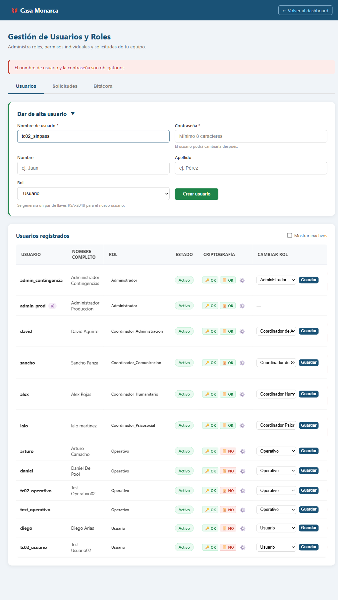
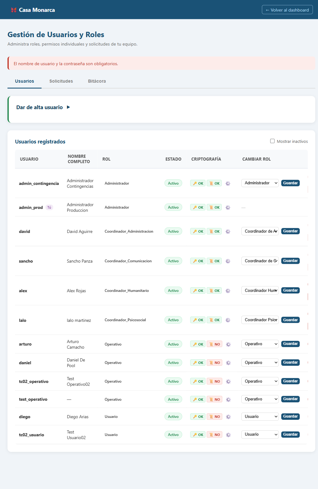
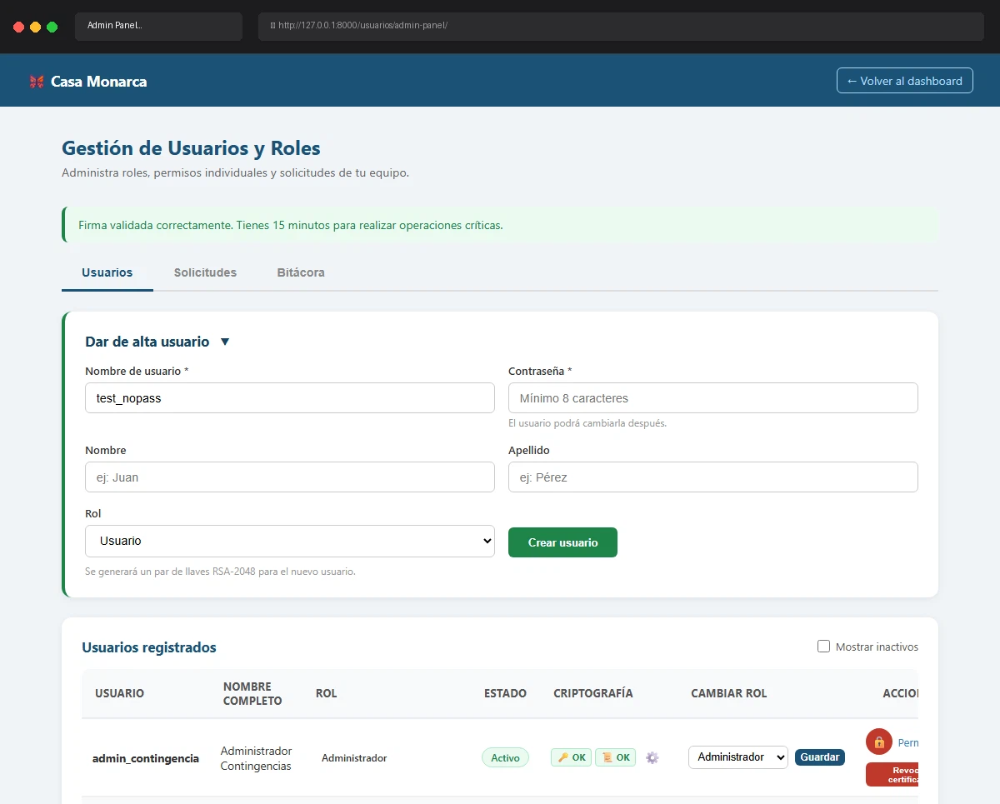

# Caso de Prueba: TC-02-06 — Crear usuario sin contraseña

| Campo | Valor |
|---|---|
| **Rol(es)** | Administrador (ejecutor) |
| **Categoría** | 02 — Gestión de Usuarios |
| **Metodología** | Login — Ingresar Firma — Admin Panel — Crear usuario |
| **Fecha de ejecución** | 2026-05-29 |
| **Motor** | Playwright MCP (Claude Code) |
| **Estado** | ✅ PASS |

## Descripción
Intento de crear un usuario **sin contraseña** (solo username). Verifica el mensaje de error de obligatoriedad. Se omitió la validación HTML5 (`required`) enviando por JavaScript para alcanzar la validación de servidor.

## Precondiciones
- Sesión de `admin_prod` con firma cargada; Admin Panel abierto.

## Pasos ejecutados
| # | Acción | Ubicación / Selector / Dato | Resultado esperado | Evidencia |
|---|---|---|---|---|
| 1 | Llenar solo username (password vacío) | `#new_username`=`tc02_sinpass`, `#new_password` vacío | Formulario incompleto | `TC-02-06_paso-1.png` |
| 2 | Enviar (bypass HTML5) | `#create-form form` → `submit()` | Error de obligatoriedad | `TC-02-06_paso-2.png` |

## Resultado esperado
- Mensaje: **"El nombre de usuario y la contraseña son obligatorios."**; no se crea usuario.

## Resultado obtenido
- ✅ Mensaje mostrado: **"El nombre de usuario y la contraseña son obligatorios."**
- ✅ El usuario `tc02_sinpass` **no** fue creado (verificado en BD).

## Evidencia

**Paso 1 — Formulario con contraseña vacía**

**Paso 2 — Error "El nombre de usuario y la contraseña son obligatorios."**

**Evidencia animada (corrida previa, conservada como resumen):**

## Conclusión
✅ **PASS.** La validación de servidor rechaza la creación sin contraseña con el mismo mensaje de obligatoriedad.
