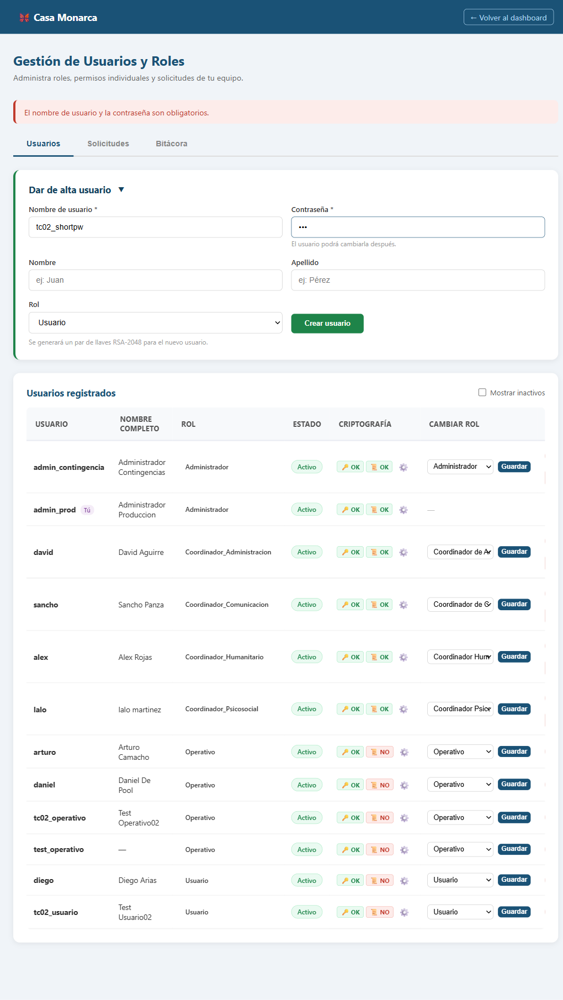
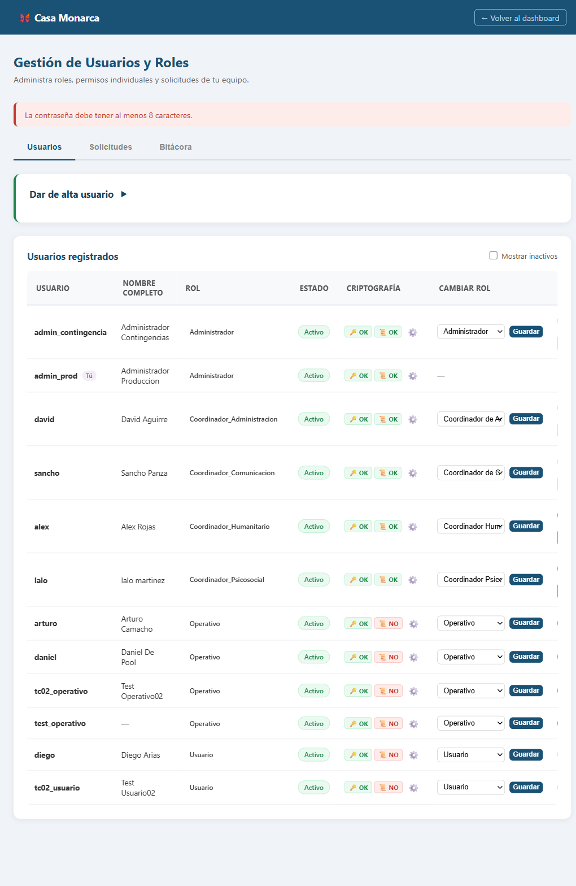
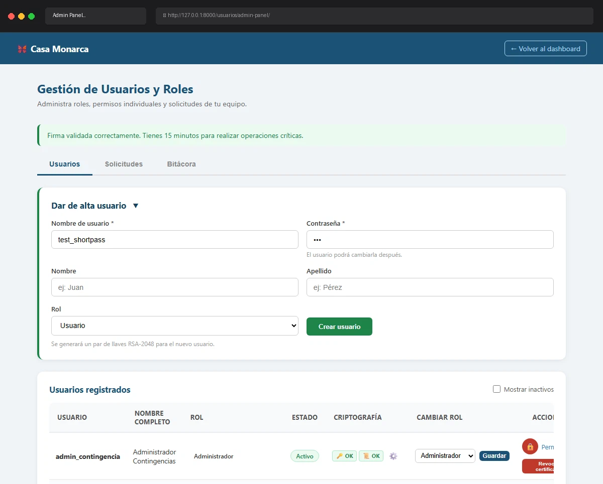

# Caso de Prueba: TC-02-07 — Crear usuario con contraseña menor a 8 caracteres

| Campo | Valor |
|---|---|
| **Rol(es)** | Administrador (ejecutor) |
| **Categoría** | 02 — Gestión de Usuarios |
| **Metodología** | Login — Ingresar Firma — Admin Panel — Crear usuario |
| **Fecha de ejecución** | 2026-05-29 |
| **Motor** | Playwright MCP (Claude Code) |
| **Estado** | ✅ PASS |

## Descripción
Intento de crear un usuario con contraseña de menos de 8 caracteres. Verifica el mensaje de validación de longitud mínima (servidor). Se omitió la validación HTML5 (`minlength=8`) enviando por JavaScript.

## Precondiciones
- Sesión de `admin_prod` con firma cargada; Admin Panel abierto.

## Pasos ejecutados
| # | Acción | Ubicación / Selector / Dato | Resultado esperado | Evidencia |
|---|---|---|---|---|
| 1 | Llenar con contraseña corta | `#new_username`=`tc02_shortpw` · `#new_password`=`123` | Contraseña inválida (3 < 8) | `TC-02-07_paso-1.png` |
| 2 | Enviar (bypass HTML5) | `#create-form form` → `submit()` | Error de longitud mínima | `TC-02-07_paso-2.png` |

## Resultado esperado
- Mensaje: **"La contraseña debe tener al menos 8 caracteres."**; no se crea usuario.

## Resultado obtenido
- ✅ Mensaje mostrado: **"La contraseña debe tener al menos 8 caracteres."**
- ✅ El usuario `tc02_shortpw` **no** fue creado (verificado en BD).

## Evidencia

**Paso 1 — Formulario con contraseña de 3 caracteres**

**Paso 2 — Error "La contraseña debe tener al menos 8 caracteres."**

**Evidencia animada (corrida previa, conservada como resumen):**

## Conclusión
✅ **PASS.** La validación de longitud mínima de contraseña opera en el servidor, independientemente de la validación del navegador.
