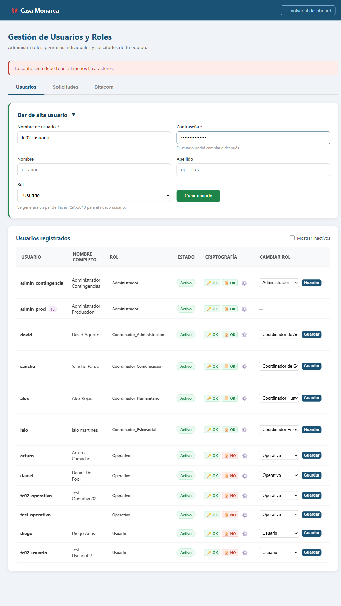
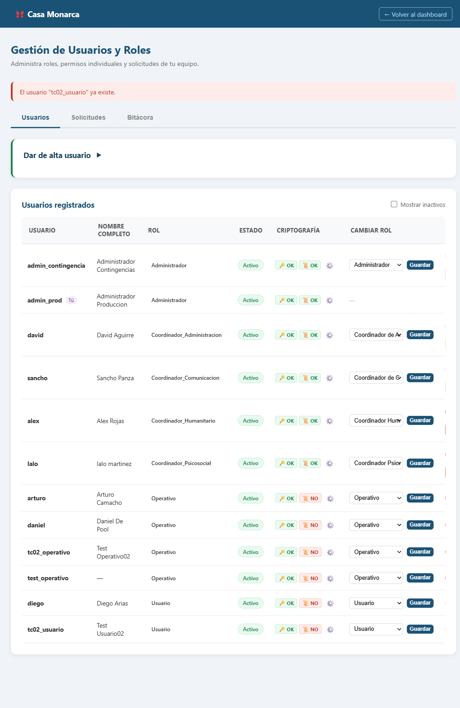
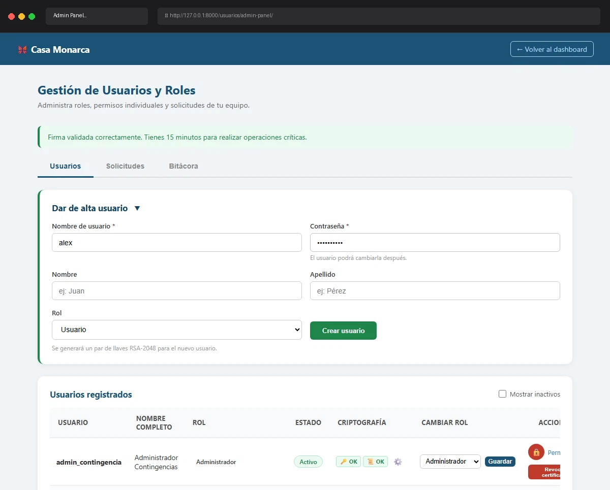

# Caso de Prueba: TC-02-08 — Crear usuario con username duplicado

| Campo | Valor |
|---|---|
| **Rol(es)** | Administrador (ejecutor) |
| **Categoría** | 02 — Gestión de Usuarios |
| **Metodología** | Login — Ingresar Firma — Admin Panel — Crear usuario |
| **Fecha de ejecución** | 2026-05-29 |
| **Motor** | Playwright MCP (Claude Code) |
| **Estado** | ✅ PASS |

## Descripción
Intento de crear un usuario con un nombre de usuario que **ya existe** (`tc02_usuario`, creado en TC-02-01). Verifica el mensaje de duplicado y que no se crea un segundo usuario.

## Precondiciones
- Existe `tc02_usuario` (TC-02-01).
- Sesión de `admin_prod` con firma cargada; Admin Panel abierto.

## Pasos ejecutados
| # | Acción | Ubicación / Selector / Dato | Resultado esperado | Evidencia |
|---|---|---|---|---|
| 1 | Llenar con username existente | `#new_username`=`tc02_usuario` · `#new_password`=`ClaveSegura2026` | Username duplicado | `TC-02-08_paso-1.png` |
| 2 | Enviar | `#create-form form` → `submit()` | Error de duplicado | `TC-02-08_paso-2.png` |

## Resultado esperado
- Mensaje: **"El usuario \"tc02_usuario\" ya existe."**; no se crea un duplicado.

## Resultado obtenido
- ✅ Mensaje mostrado: **"El usuario \"tc02_usuario\" ya existe."**
- ✅ No se creó un segundo usuario.

## Evidencia

**Paso 1 — Formulario con username ya existente**

**Paso 2 — Error "El usuario \"tc02_usuario\" ya existe."**

**Evidencia animada (corrida previa, conservada como resumen):**

## Conclusión
✅ **PASS.** El sistema impide nombres de usuario duplicados con un mensaje claro.
