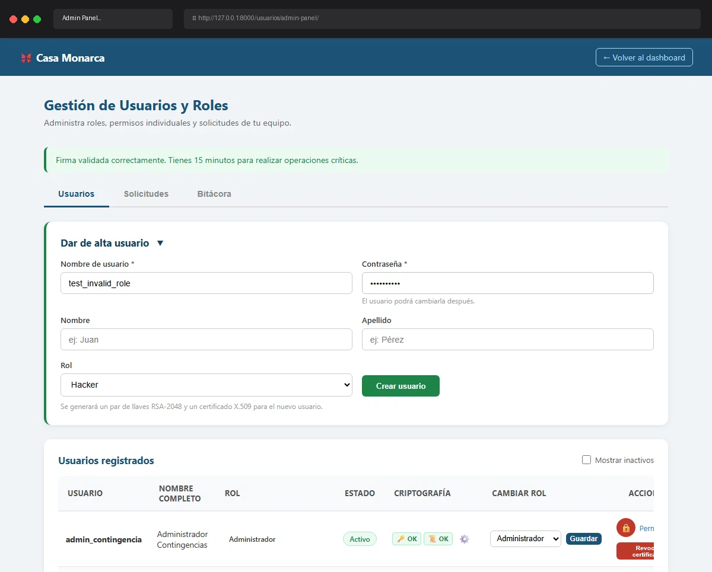

# Caso de Prueba TC-02-09

**Roles:** Administrador
**Descripción:** Crear usuario con rol inválido (manipulación de formulario). Verificar mensaje "Rol inválido."
**Metodología:** Login — Ingresar Firma — Admin Panel (tab Usuarios) — Crear usuario

## Evidencia de Ejecución

A continuación se muestra el video de la ejecución del caso de prueba:

## Pasos Realizados y Verificaciones

1. (La evidencia animada documenta los pasos visuales).
