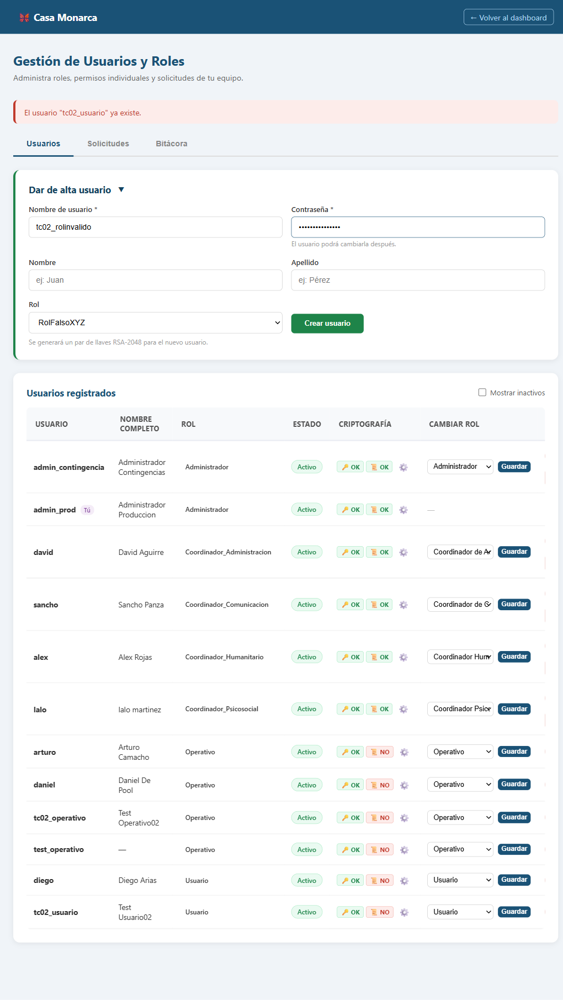
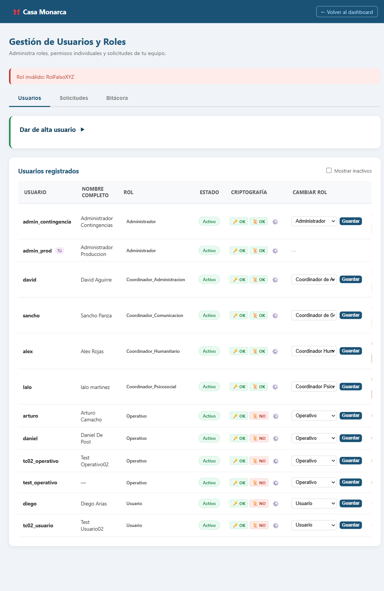

# Caso de Prueba: TC-02-09 — Crear usuario con rol inválido (manipulación de formulario)

| Campo | Valor |
|---|---|
| **Rol(es)** | Administrador (ejecutor) |
| **Categoría** | 02 — Gestión de Usuarios |
| **Metodología** | Login — Ingresar Firma — Admin Panel — Crear usuario (form tampering) |
| **Fecha de ejecución** | 2026-05-29 |
| **Motor** | Playwright MCP (Claude Code) |
| **Estado** | ✅ PASS |

## Descripción
Intento de crear un usuario con un **rol inválido**, manipulando el `<select>` de rol vía JavaScript para enviar un valor no permitido. Verifica que el servidor valida el rol contra la lista permitida.

## Precondiciones
- Sesión de `admin_prod` con firma cargada; Admin Panel abierto.

## Pasos ejecutados
| # | Acción | Ubicación / Selector / Dato | Resultado esperado | Evidencia |
|---|---|---|---|---|
| 1 | Llenar y manipular el rol | `#new_username`=`tc02_rolinvalido` · `#new_password`=`ClaveSegura2026` · `#new_rol` inyectado a `RolFalsoXYZ` | Valor de rol fuera de catálogo | `TC-02-09_paso-1.png` |
| 2 | Enviar | `#create-form form` → `submit()` | Error de rol inválido | `TC-02-09_paso-2.png` |

## Resultado esperado
- Mensaje: **"Rol inválido: RolFalsoXYZ"** (el servidor valida `rol not in roles_validos`); no se crea usuario.

## Resultado obtenido
- ✅ Mensaje mostrado: **"Rol inválido: RolFalsoXYZ"**.
- ✅ El usuario `tc02_rolinvalido` **no** fue creado (verificado en BD).

## Evidencia

**Paso 1 — `<select>` de rol manipulado a `RolFalsoXYZ`**

**Paso 2 — Error "Rol inválido: RolFalsoXYZ"**

**Evidencia animada (corrida previa, conservada como resumen):**

## Conclusión
✅ **PASS.** La validación de rol ocurre en el servidor: aun manipulando el formulario en el navegador, un rol fuera del catálogo es rechazado.
