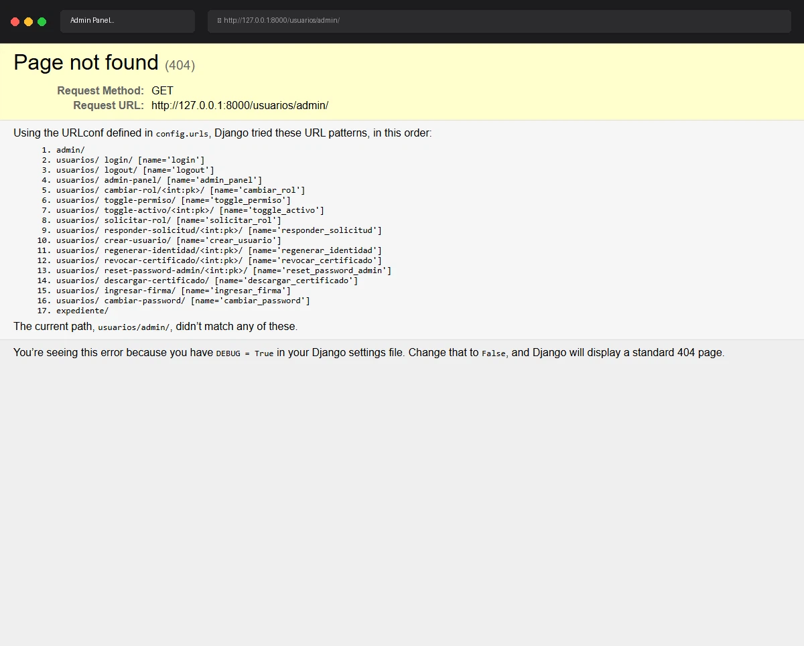

# Caso de Prueba TC-02-10

**Roles:** Administrador
**Descripción:** Crear usuario Coordinador cuando la firma del admin ha expirado (>15 min). Verificar redirect a Ingresar Firma con aviso de sesión expirada.
**Metodología:** Login — Admin Panel (tab Usuarios) — Crear usuario (firma expirada) — Ingresar Firma

## Evidencia de Ejecución

A continuación se muestra el video de la ejecución del caso de prueba:

## Pasos Realizados y Verificaciones

1. (La evidencia animada documenta los pasos visuales).
