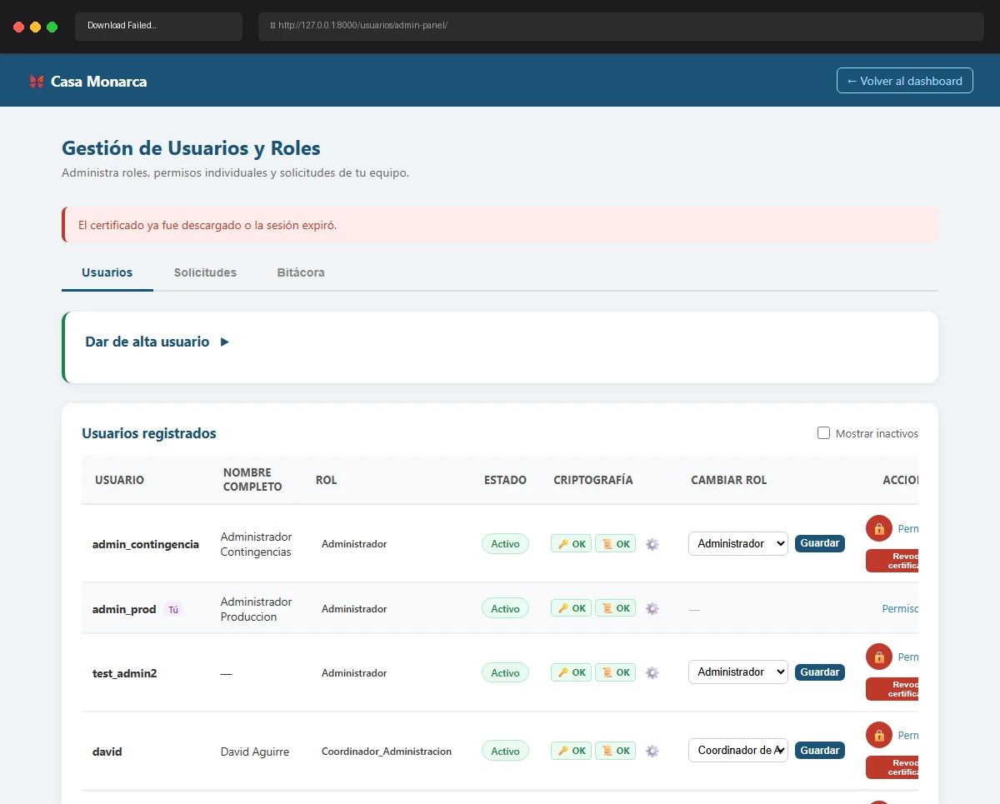

# Caso de Prueba TC-02-12

**Roles:** Administrador
**Descripción:** Intentar descargar certificado por segunda vez. Verificar mensaje "El certificado ya fue descargado o la sesión expiró." (el ZIP se borra de la sesión tras la primera descarga).
**Metodología:** Login — Ingresar Firma — Admin Panel — Descargar certificado (segunda vez)

## Evidencia de Ejecución

A continuación se muestra el video de la ejecución del caso de prueba:

## Pasos Realizados y Verificaciones

1. (La evidencia animada documenta los pasos visuales).
