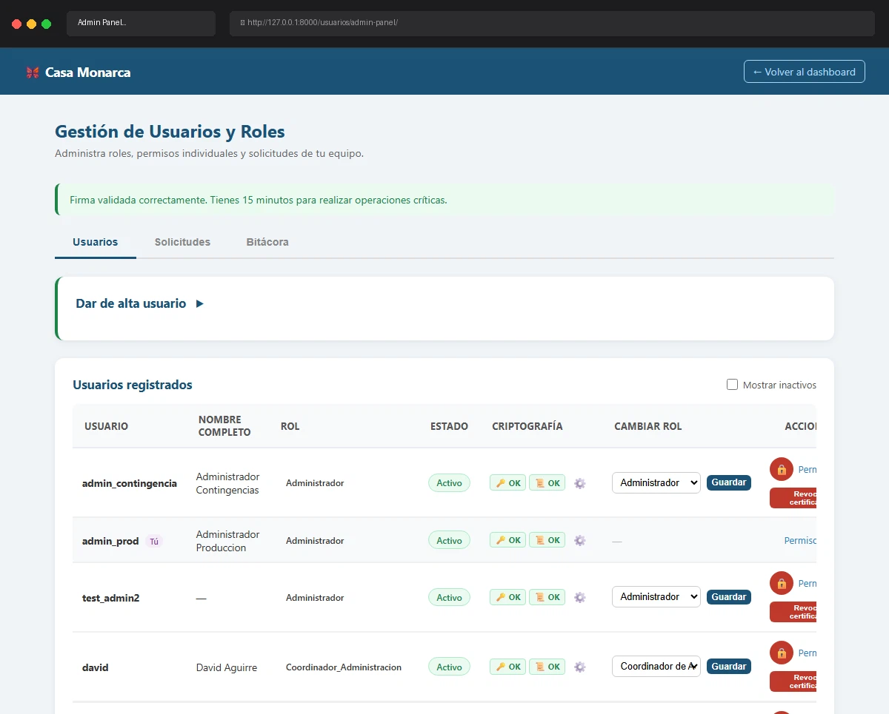

# Caso de Prueba TC-02-14

**Roles:** Administrador
**Descripción:** Toggle activar/desactivar usuario. Verificar que el campo `activo` e `is_active` cambian, que se registra en bitácora y que el usuario desactivado no puede hacer login.
**Metodología:** Login — Ingresar Firma — Admin Panel (tab Usuarios) — Toggle activo

## Evidencia de Ejecución

A continuación se muestra el video de la ejecución del caso de prueba:

## Pasos Realizados y Verificaciones

1. (La evidencia animada documenta los pasos visuales).
