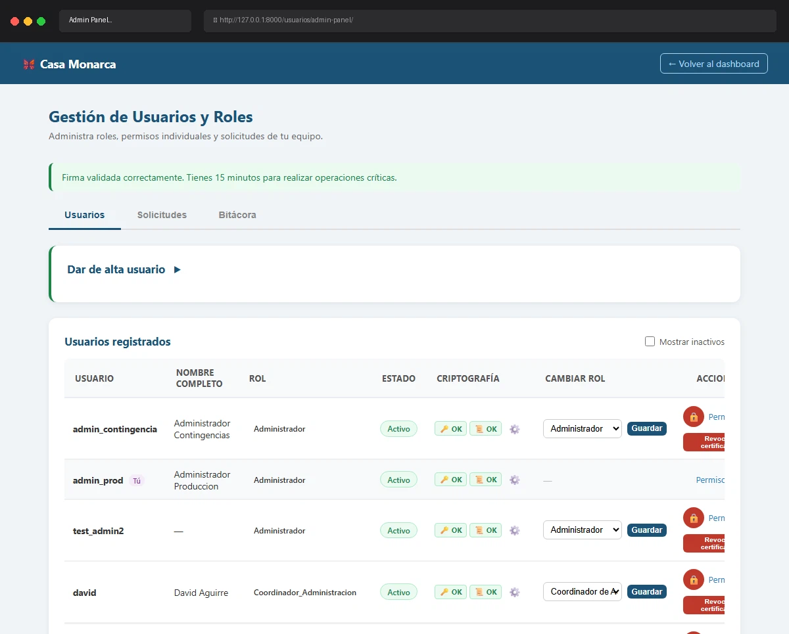

# Caso de Prueba TC-02-15

**Roles:** Administrador
**Descripción:** Intentar desactivarse a sí mismo. Verificar mensaje "No puedes desactivarte a ti mismo."
**Metodología:** Login — Ingresar Firma — Admin Panel (tab Usuarios) — Toggle activo (propio)

## Evidencia de Ejecución

A continuación se muestra el video de la ejecución del caso de prueba:

## Pasos Realizados y Verificaciones

1. (La evidencia animada documenta los pasos visuales).
