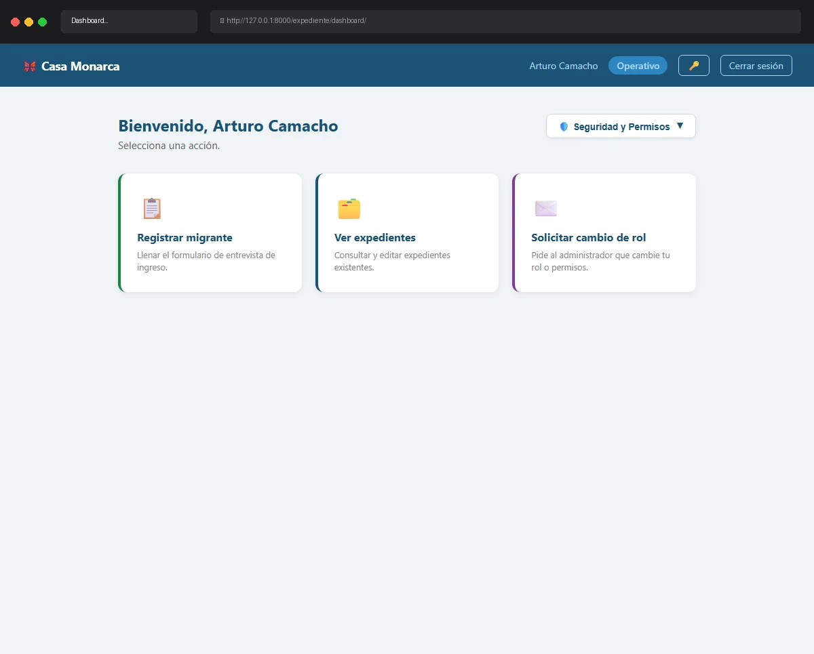

# Caso de Prueba TC-02-18

**Roles:** Coordinador, Operativo, Usuario
**Descripción:** Intentar acceder al Admin Panel sin ser Administrador. Verificar redirect al Dashboard con mensaje "No tienes permisos para acceder a esta sección."
**Metodología:** Login — Admin Panel (acceso directo por URL)

## Evidencia de Ejecución

A continuación se muestra el video de la ejecución del caso de prueba:

## Pasos Realizados y Verificaciones

1. (La evidencia animada documenta los pasos visuales).
